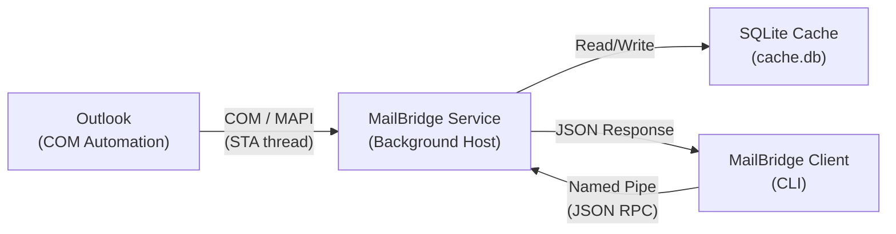
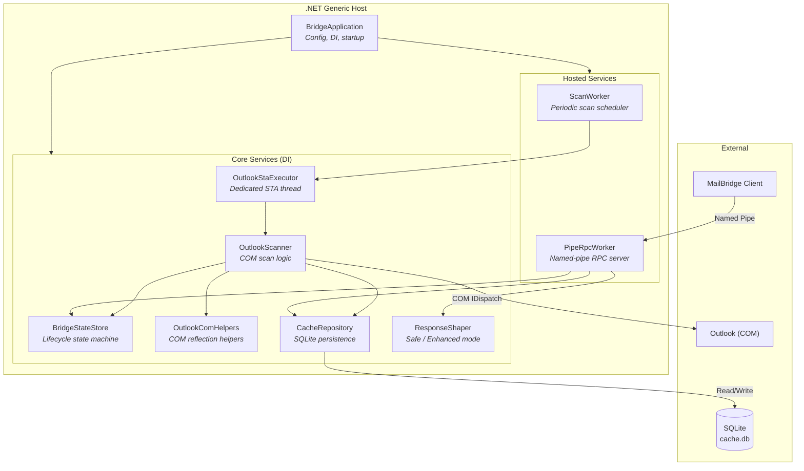
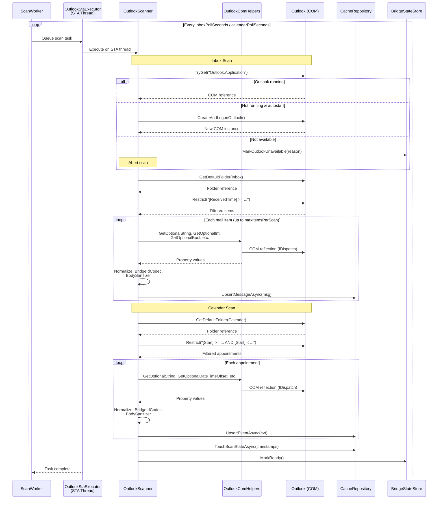
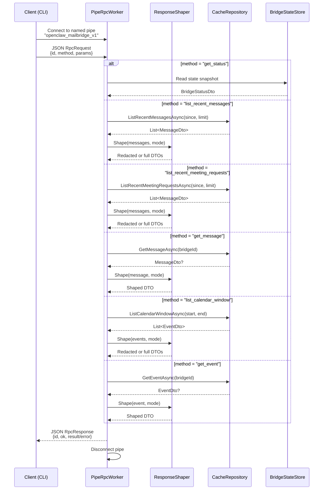
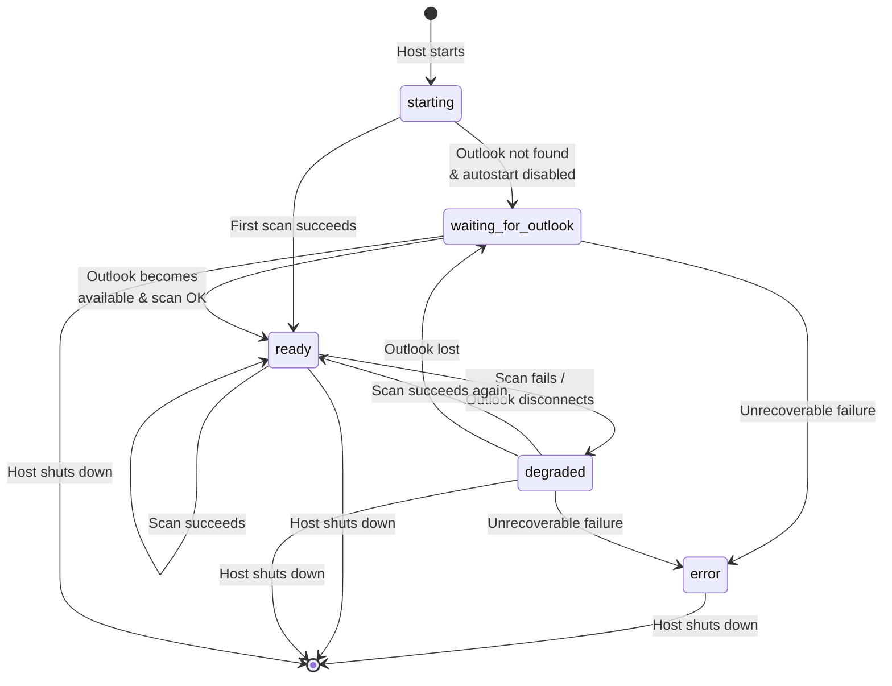
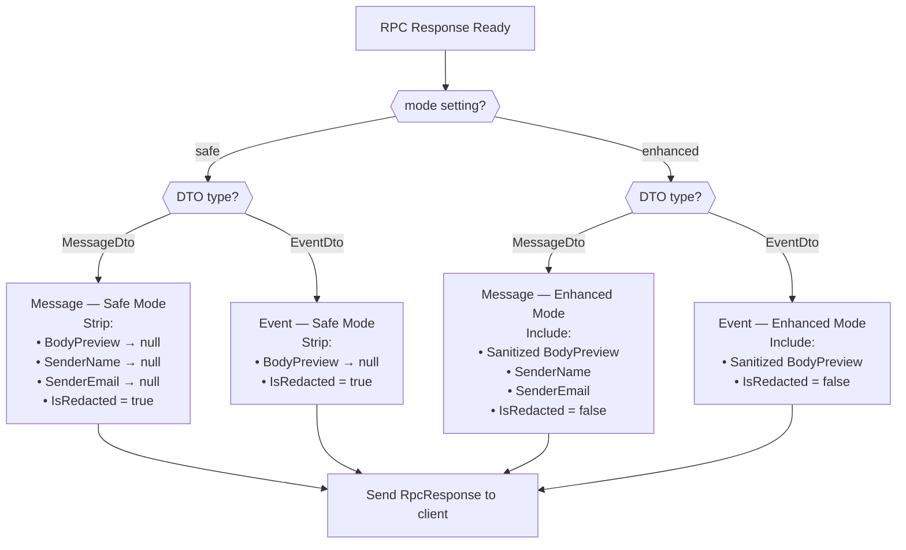
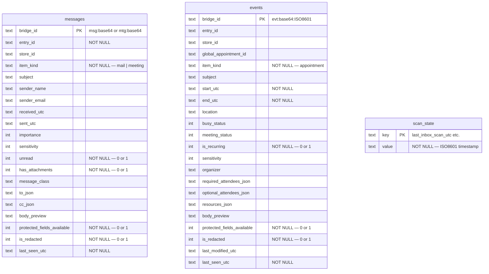
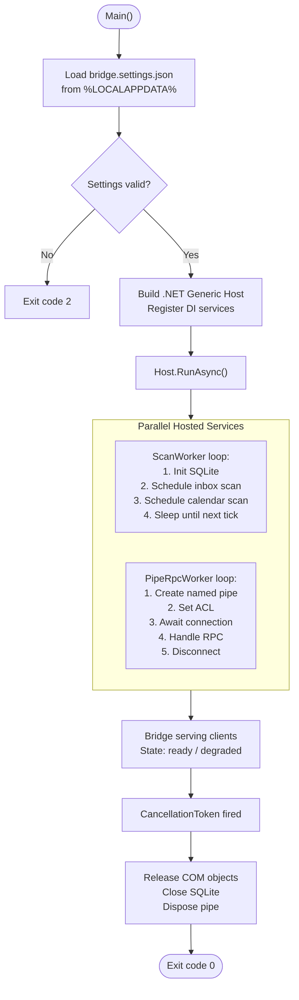

# OpenClaw MailBridge — Architecture Diagrams

## 1. High-Level System Overview

## 2. Component Architecture

## 3. Scanning Pipeline — Data Flow

## 4. RPC Request / Response Flow

## 5. Bridge State Machine

## 6. Response Shaping — Safe vs Enhanced Mode

## 7. Data Model — SQLite Cache

## 8. End-to-End Lifecycle

