# OpenClaw MailBridge — Architecture Diagrams

The Mermaid diagrams in this document set a 14px font baseline, which is approximately 10.5pt, in renderers that honor Mermaid init directives. Extremely wide diagrams may still be scaled down by the Markdown host, so the widest diagrams also use shorter labels or more vertical layouts to improve readability.

## 0. Additive Deployment Topology

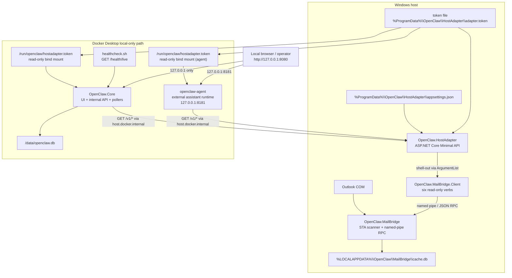

This topology includes two container services that independently consume the HostAdapter HTTP API. `OpenClaw.Core` is the repository-owned UI and cache container. `openclaw-agent` is the external OpenClaw assistant runtime for AI-powered triage and summarization. Both run as non-root containers with read-only root filesystems, loopback-only port publishing, and read-only token-file bind mounts. The current Windows path remains available as the fallback to `OpenClaw.MailBridge.Client`.

## 1. Existing Bridge Runtime

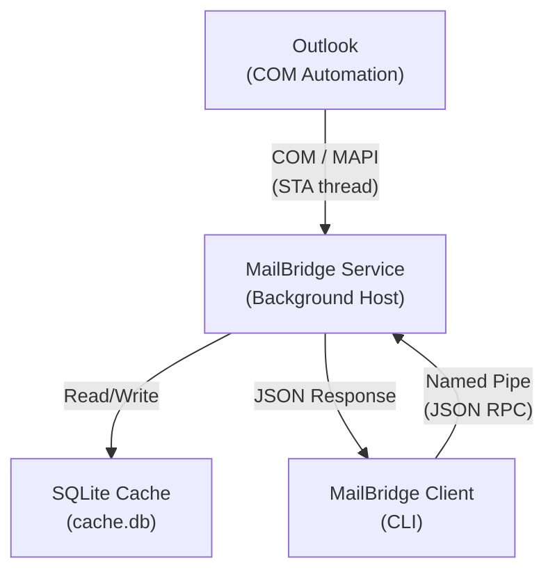

## 2. Deployed Component Architecture

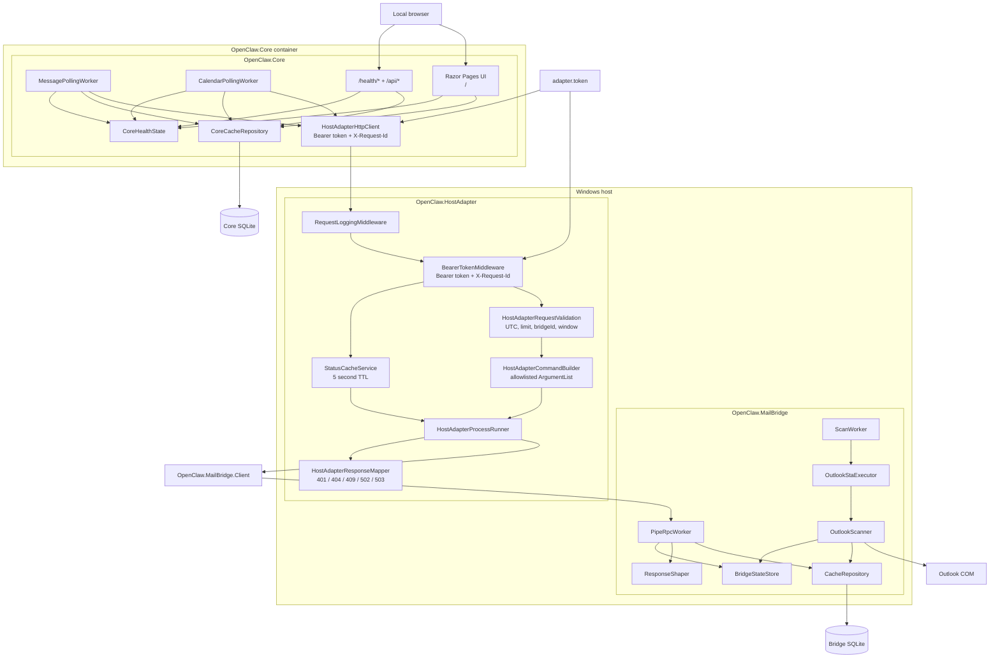

## 3. HostAdapter Request Path

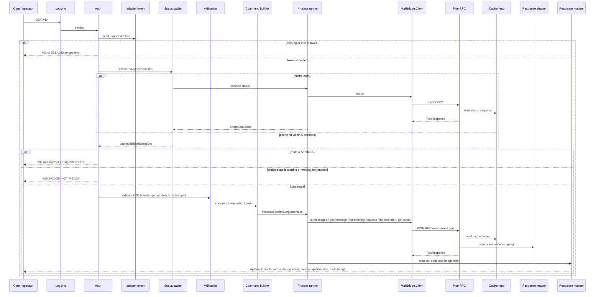

The HostAdapter is intentionally narrow. It adds token authentication, request correlation, deterministic validation, short-lived status caching, HTTP envelope metadata, and CLI-to-HTTP error mapping without introducing direct container access to the named pipe.

## 4. Core Polling, Persistence, and Degraded Reads

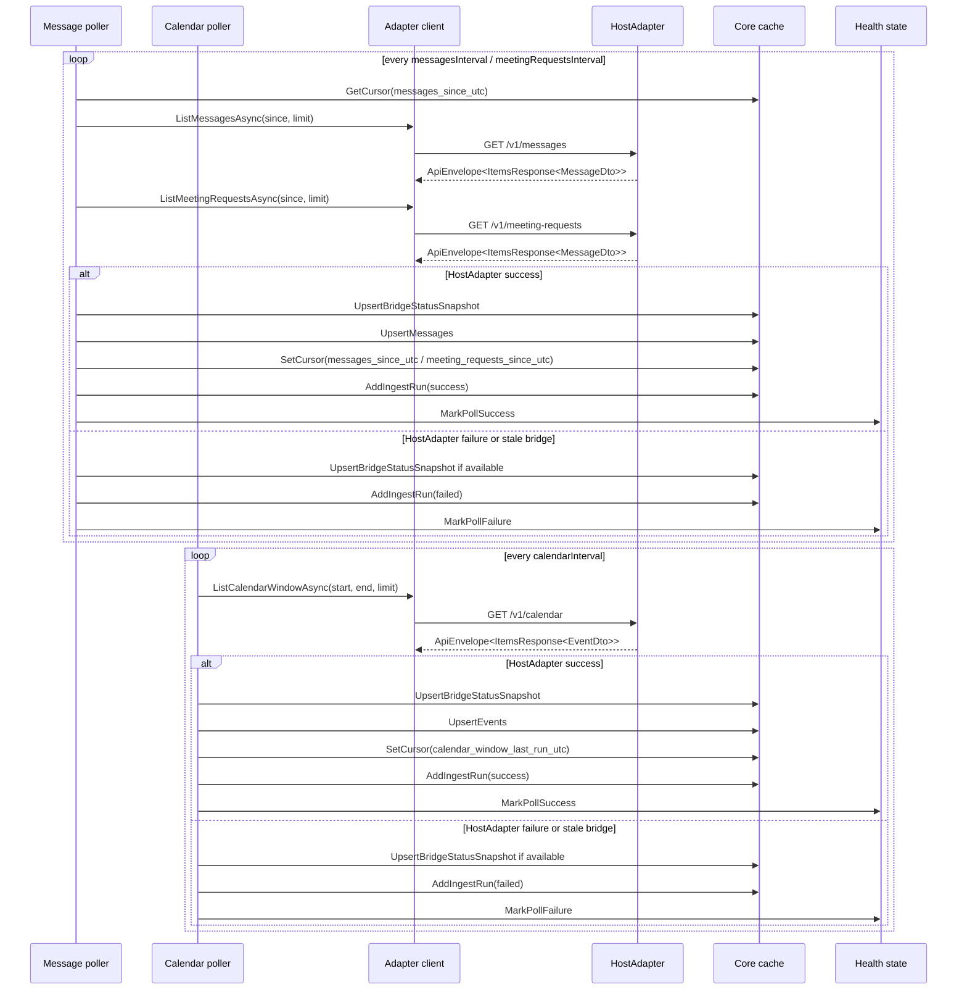

When the bridge becomes unavailable, `OpenClaw.Core` keeps its SQLite cache and continues serving cached reads. The degraded condition is surfaced through `CoreHealthState`, `/health/ready`, `/api/status`, and the UI instead of being hidden behind retries.

## 5. Core Cached-Read UI and API Flow

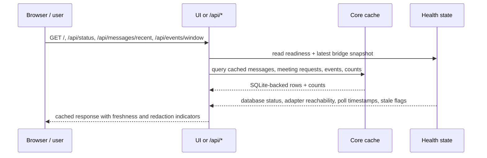

The Core read path is cache-backed by design. UI and internal API requests do not fan out into live bridge calls. The page at `/` shows recent mail, meeting requests, and events with stale and redacted badges, while `/api/status` returns cache counts, bridge freshness, and failure timestamps.

## 6. Bridge State Machine

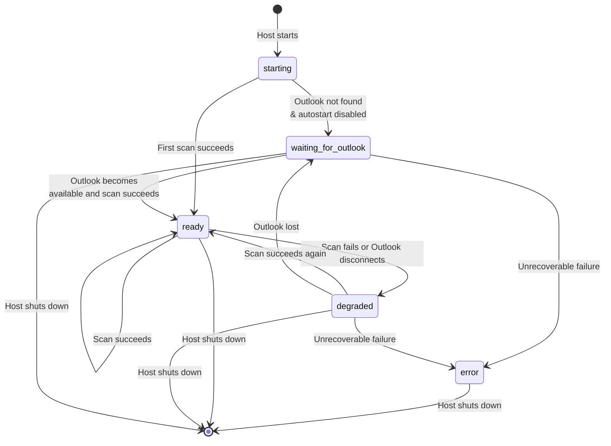

`starting` and `waiting_for_outlook` are treated as bridge-not-ready states by the HostAdapter and return `409`. `degraded` remains readable for cached data and is propagated end-to-end through HostAdapter metadata and Core health/status surfaces.

## 7. Safe vs Enhanced Response Shaping

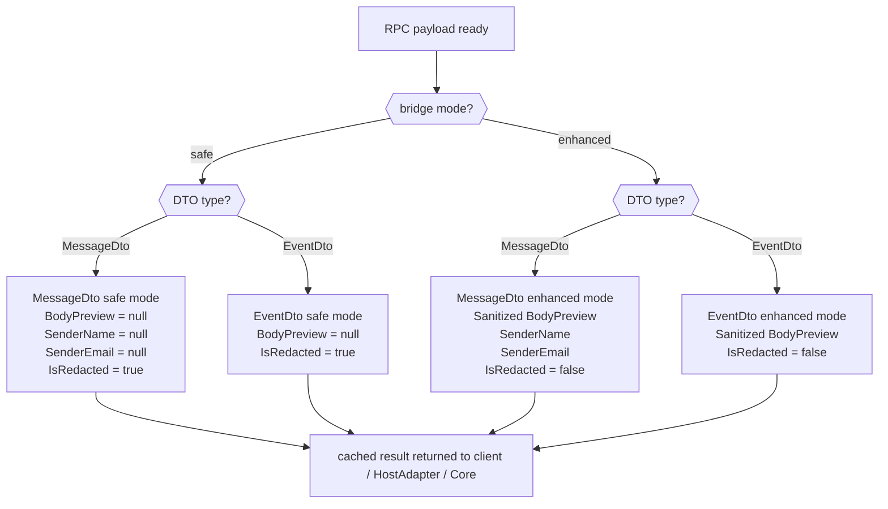

The privacy boundary still belongs to the Windows bridge. HostAdapter and Core surface `isRedacted`, `protectedFieldsAvailable`, bridge mode, and stale-cache state, but they do not attempt to reconstruct redacted fields.

## 8. SQLite Data Models

### 8.1 Bridge Cache

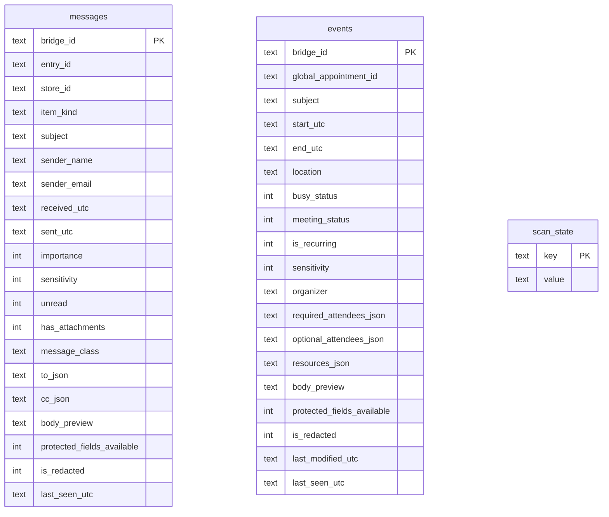

### 8.2 Core Cache

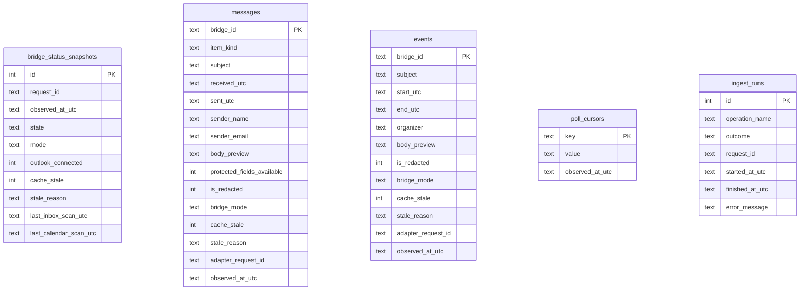

The feature adds a second SQLite boundary under `/data/openclaw.db`. It stores the latest bridge state, poll cursors, ingest history, and cached message/event rows with request IDs, stale flags, and redaction metadata preserved from the HostAdapter envelope.

## 9. Core Health, Readiness, and Container Hardening

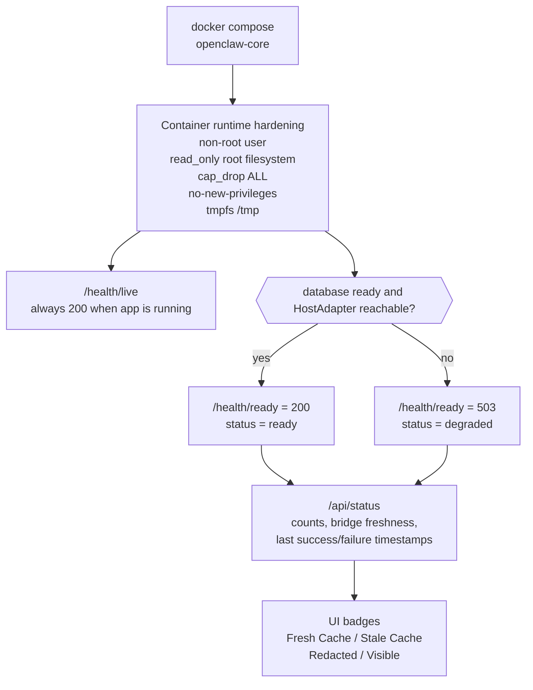

The health model is intentionally split. Liveness proves the container is running. `/health/ready` proves both SQLite initialization and HostAdapter reachability. `/api/status` and the UI provide the operator detail needed to diagnose stale cache, failed polls, and bridge unavailability without exposing token values, message bodies, or attendee details.

## 10. End-to-End Lifecycle

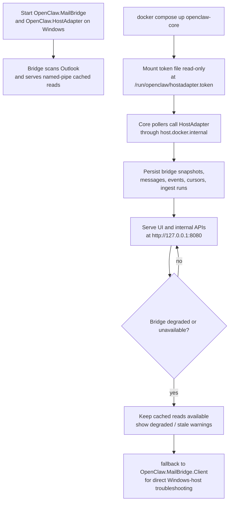

This is the deployed additive flow. The Windows bridge remains the source of Outlook access and response shaping, while the new HostAdapter and Core layers add authenticated HTTP access, containerized polling, local-only UI/API endpoints, cached-read persistence, health signaling, and a documented degraded-state fallback path.
