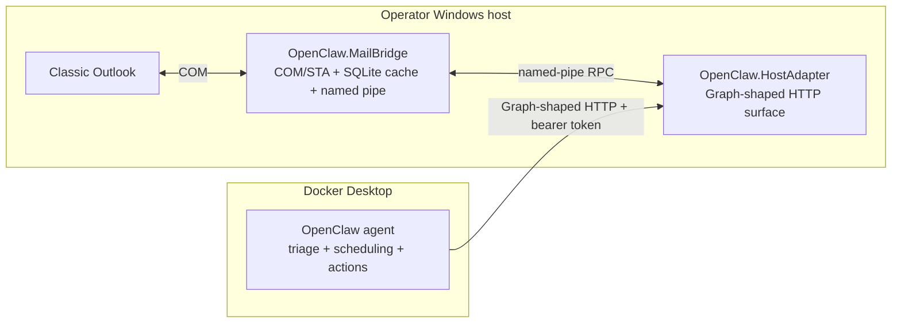
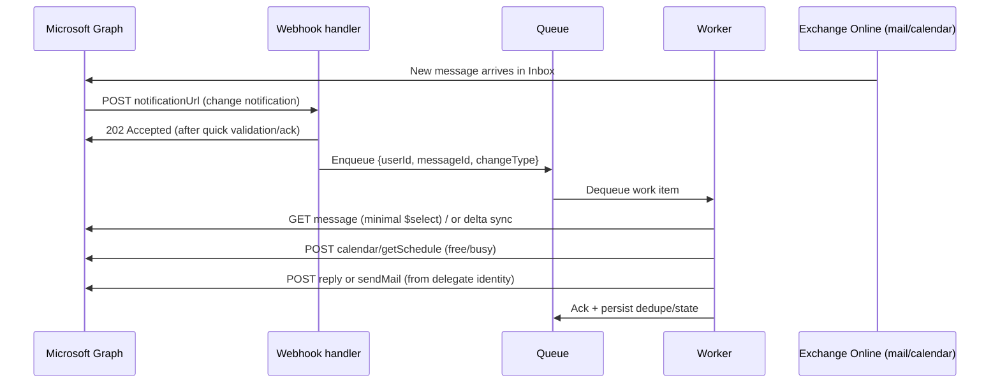

# OpenClaw Administrative Assistant — Master Approach (Consolidated)

> **Provenance.** This document consolidates three prior drafts: (1) `docs/original-scope/open-claw-approach.md` (earliest markdown draft), (2) `artifacts/research/_pdf-extracts/updated_v2-vision.txt` (mid-revision addendum that introduced Application RBAC), and (3) `artifacts/research/_pdf-extracts/fully-rendered-v2-mvp.txt` (final, finalized MVP). All three are superseded by this consolidated document. Architecture decisions are resolved in favor of source (3): app-only OAuth 2.0 client credentials, Exchange Online Application RBAC for mailbox scoping, meeting-context-first processing, 5-way deterministic triage, and Send on behalf as the outbound identity model. Content from sources (1) and (2) is retained where source (3) is silent or where source (1) contains uniquely detailed policy rules and pseudocode not replicated in the final draft.

> **Delivery model.** This specification is organized around three delivery stages — a **Local MVP** (a local stepping stone), **Product Increment 1** (the cloud Exchange RBAC version specified in Sections 1–14), and the **Final Vision** (the matured system). The three stages, and the contract-parity strategy that lets the OpenClaw agent move between them unchanged, are defined in [Delivery Stages](#delivery-stages-local-mvp-product-increment-1-and-final-vision) immediately below. Sections 1–14 specify the cloud target; the Local MVP realizes the same agent-facing contract locally.

---

## Table of Contents

**Delivery framing:** [Delivery Stages: Local MVP, Product Increment 1, and Final Vision](#delivery-stages-local-mvp-product-increment-1-and-final-vision)

1. [Executive Summary](#1-executive-summary)
2. [Functional Design and Deterministic Operating Model](#2-functional-design-and-deterministic-operating-model)
3. [Microsoft Graph APIs and Endpoints Required](#3-microsoft-graph-apis-and-endpoints-required)
4. [Identity, OAuth Flow, Permissions, and Token Management](#4-identity-oauth-flow-permissions-and-token-management)
5. [Mailbox and Calendar Delegation Design](#5-mailbox-and-calendar-delegation-design)
6. [Eventing, Synchronization, and Error Handling](#6-eventing-synchronization-and-error-handling)
7. [Security and Compliance Considerations](#7-security-and-compliance-considerations)
8. [Deployment Options, Reference Architecture, and MVP Plan](#8-deployment-options-reference-architecture-and-mvp-plan)
9. [Deterministic Triage: 5-Way Decision Model](#9-deterministic-triage-5-way-decision-model)
10. [Owner-Specific Priority and Scheduling Policy](#10-owner-specific-priority-and-scheduling-policy)
11. [Rescheduling Pathways](#11-rescheduling-pathways)
12. [Administrator Checklist](#12-administrator-checklist)
13. [Developer Implementation Checklist](#13-developer-implementation-checklist)
14. [Selected Microsoft Learn References](#14-selected-microsoft-learn-references)
15. [Editorial Reconciliation Notes](#15-editorial-reconciliation-notes)

---

## Delivery Stages: Local MVP, Product Increment 1, and Final Vision

This specification is delivered in three stages. Every stage presents the **same agent-facing contract** to the OpenClaw agent: a Microsoft Graph-shaped HTTP surface. Only the implementation behind that contract changes between stages. This lets the OpenClaw agent — its triage rules, scheduling logic, and actions — be developed and refined once, against a stable contract, and carried forward unchanged as the backend matures from a local Outlook integration to a cloud Microsoft Graph service.

**Core principle — contract parity.** The agent never calls Outlook COM or vendor-specific APIs directly; it calls a Graph-shaped surface. In the Local MVP that surface is served by `OpenClaw.HostAdapter` backed by `OpenClaw.MailBridge` over COM. In Product Increment 1 the same surface is served by Microsoft Graph. Replacing the backend does not change the agent. The Local MVP exists to refine the OpenClaw agent and its actions on real mail and calendar data before any production rollout, while deferring cloud-only concerns (tenant authorization, hosting, audit) to Product Increment 1.

### Stage definitions

**Stage 0 — Local MVP (stepping stone).**

- Goal: a local realization of every capability that will later be cloud-hosted, so the OpenClaw agent and its actions can be proven before production.
- Email access: the COM-based `OpenClaw.MailBridge` suite reads — and, for the action layer, writes — the local Outlook data on a dedicated STA thread.
- Adapter: `OpenClaw.HostAdapter` is a **Graph-like adapter**. It exposes the same Graph-shaped endpoints the agent will use in the cloud, and on the back end it satisfies each call through `OpenClaw.MailBridge` instead of Microsoft Graph.
- Runs entirely on the operator's Windows host (bridge + adapter) plus Docker Desktop (agent). No Azure, no Entra app registration, no Exchange administrator involvement.
- Scope: a single local mailbox (the signed-in Outlook profile).

**Stage 1 — Product Increment 1 (cloud RBAC version).**

- The finalized cloud design specified in the remainder of this document: app-only OAuth 2.0 client credentials, Exchange Online Application RBAC mailbox scoping, an Azure-hosted event-driven service, and Microsoft Graph for all mail and calendar access.
- The COM-backed `OpenClaw.HostAdapter` is replaced by a Graph-backed implementation of the same agent-facing contract (or the agent calls Microsoft Graph directly through that contract). The agent logic carried over from the Local MVP is unchanged.
- Scope: an administrator-approved mailbox set; a read-and-reply assistant in production.

**Stage 2 — Final Vision (matured system).**

- The matured end state: calendar-write capability enabled (organizer-side rescheduling and attendee-side propose-new-time, behind feature flags), broader mailbox scope, and full audit and observability (Graph activity logs + Microsoft Purview).
- Builds on Product Increment 1 without re-architecture; the write paths in Section 11 and the hardening controls in Sections 6–7 are enabled progressively.

### Stage comparison

| Dimension | Stage 0 — Local MVP | Stage 1 — Product Increment 1 | Stage 2 — Final Vision |
|---|---|---|---|
| Mail/calendar source | Local Outlook via COM (`OpenClaw.MailBridge`) | Microsoft Graph (cloud) | Microsoft Graph (cloud) |
| Agent-facing contract | Graph-shaped HTTP (`OpenClaw.HostAdapter`) | Graph-shaped HTTP / Microsoft Graph | Microsoft Graph |
| Adapter backend | COM bridge | Microsoft Graph | Microsoft Graph |
| Auth (agent → adapter) | Local bearer token + named-pipe ACL | OAuth 2.0 client credentials (app-only) | OAuth 2.0 client credentials (app-only) |
| Mailbox scoping | Single local profile | Exchange Online Application RBAC | Exchange Online Application RBAC |
| Eventing | Local polling + in-process queue | Graph subscriptions + webhook + queue | Graph subscriptions + webhook + queue |
| Outbound | COM send (single local mailbox) | `sendMail` Send-on-behalf via assistant mailbox | `sendMail` Send-on-behalf via assistant mailbox |
| Calendar writes | Deferred / optional | Read-and-reply only | Enabled behind feature flags |
| Hosting | Operator Windows host + Docker Desktop | Azure (Functions / Container Apps) | Azure (Functions / Container Apps) |
| Audit | Local structured logs | Graph activity logs + Purview | Graph activity logs + Purview |
| Mailbox count | One | Approved set | Approved set / multi-tenant as applicable |

### Local MVP architecture



In Product Increment 1 the `Agent` box is unchanged; the `Adapter` is replaced by a Graph-backed implementation and the `Local` subgraph is replaced by Microsoft 365 / Microsoft Graph.

### Graph-contract parity mapping (Local MVP)

The Local MVP implements the Graph-shaped surface the agent expects (Section 3), translating each call to an `OpenClaw.MailBridge` operation over the named pipe. Where a Graph concept has no local equivalent, the Local MVP provides a functional substitute and defers the cloud semantics to Product Increment 1.

| Agent-facing Graph capability (Section 3) | Local MVP implementation in `OpenClaw.HostAdapter` | MailBridge backing operation | Local substitution / note |
|---|---|---|---|
| `GET /users/{id}/messages`, `messages/delta` | Graph-shaped list/sync endpoint | `list_recent_messages` | delta simulated by change-tracking over the SQLite cache |
| `GET /messages/{id}?$expand=eventMessage/event` | Graph-shaped message + event hydration | `get_message`, `get_event` | event linkage derived from COM appointment data |
| `GET /users/{id}/calendarView` | Graph-shaped windowed calendar read | `list_calendar_window` | bounded window over the cached events |
| `GET /events/{id}` | Graph-shaped event read | `get_event` | |
| `GET /users/{id}/mailboxSettings` | Graph-shaped settings read | local profile / time-zone / working-hours read (new) | sourced from local settings/config |
| `POST /users/{id}/calendar/getSchedule` | Graph-shaped free/busy | deterministic free/busy from cached calendar (new) | computed locally from the cache |
| `POST /users/{assistant}/sendMail` (Send on behalf) | Graph-shaped send endpoint | COM send via Outlook (new MailBridge action) | single local mailbox; tenant-rendered Send-on-behalf deferred to PI-1 |
| `POST /subscriptions` + webhook | local change feed or polling notification | bridge scan signals | webhook + durable queue simulated by local polling + in-process queue |
| `PATCH /events/{id}`, `…/tentativelyAccept` (roadmap) | Graph-shaped write endpoints | COM appointment update / meeting response (new) | deferred; behind feature flags |
| Auth `Authorization: Bearer` (agent → adapter) | local bearer token + named-pipe ACL | n/a | replaces OAuth client credentials + RBAC for the local stage |

### Deferred to Product Increment 1

The following are intentionally **not** reproduced locally; the Local MVP exists in part to let the agent be proven before these are introduced:

- OAuth 2.0 client-credentials auth, Entra app registration, certificate / Key Vault credential handling.
- Exchange Online Application RBAC mailbox scoping and negative-scope authorization tests.
- Microsoft Graph change-notification subscriptions and their renewal / lifecycle semantics.
- Tenant-rendered Send-on-behalf and a dedicated assistant mailbox.
- Microsoft Purview audit and Graph activity-log streaming.
- Multi-mailbox scope.

### Current state and Local MVP work

As implemented today, `OpenClaw.HostAdapter` exposes a bespoke, read-only surface (`GET /v1/status`, `/v1/messages`, `/v1/messages/{bridgeId}`, `/v1/meeting-requests`, `/v1/calendar`, `/v1/events/{bridgeId}`) rather than a Graph-shaped contract, and `OpenClaw.MailBridge` exposes six read RPC methods (`get_status`, `list_recent_messages`, `get_message`, `list_recent_meeting_requests`, `list_calendar_window`, `get_event`) with no outbound or write path. Reaching the Local MVP therefore requires two pieces of work:

1. **Contract parity:** evolve `OpenClaw.HostAdapter` from the `/v1/*` shape to the Graph-shaped surface in Section 3, so the agent code is identical to what it will use against Graph.
2. **Action layer:** add the missing MailBridge operations (`mailboxSettings` / free-busy reads, COM send, and — for the roadmap — appointment writes), populate the event attendee fields the deterministic policy needs (`RequiredAttendeesJson`, `OptionalAttendeesJson`, `ResourcesJson` on `EventDto`), and surface them through the Graph-shaped endpoints, with the deterministic triage and scheduling policy of Sections 9–10 running in the agent.

### Migration path

1. **Local MVP → Product Increment 1:** replace the COM-backed `OpenClaw.HostAdapter` with a Graph-backed implementation of the same contract (or point the agent at Microsoft Graph directly), and stand up the Stage 1 prerequisites in Sections 4, 6, and 12. The agent's triage, scheduling, and action logic carry over unchanged.
2. **Product Increment 1 → Final Vision:** enable the calendar-write feature flags (Section 11) and broaden mailbox scope and audit coverage (Sections 6–7) once the read-and-reply assistant is proven in production.

---

## 1. Executive Summary

> **Scope of Sections 1–14.** Sections 1–14 specify **Product Increment 1** (the cloud Microsoft 365 / Microsoft Graph version) and, where noted, the **Final Vision**. Within these sections, "the MVP" and "the service" refer to the cloud design. The **Local MVP** (Stage 0) implements the same agent-facing, Graph-shaped contract locally via `OpenClaw.HostAdapter` over `OpenClaw.MailBridge`; see [Delivery Stages](#delivery-stages-local-mvp-product-increment-1-and-final-vision).

The selected MVP design is an event-driven, app-only service in Microsoft 365 that uses Microsoft Graph change notifications plus delta queries, runs under OAuth 2.0 client credentials, and is mailbox-scoped with Exchange Online Application RBAC (RBAC for Applications). The service monitors the approved mailbox set, classifies scheduling traffic deterministically, reads the contents of relevant existing meetings, computes availability, and replies through a dedicated assistant mailbox. There is no delegated-permissions fallback in this plan.

The assistant is meeting-context first, not free/busy first. Before it proposes or changes time, it reads the actual calendar event data for relevant meetings unless the meeting is marked `sensitivity=private` or private-item policy prevents content access. The agent normalizes and reasons over:

- logical organizer
- actual sender of the meeting message when available
- invited attendees (required, optional, resource)
- series metadata (`iCalUId`, `seriesMasterId`, recurrence)
- online-meeting metadata
- categories and subject/body cues
- whether the meeting looks dependency-bearing for other meetings or operating processes

Availability still matters, but it is used after the assistant understands what the existing meetings are. `calendar/getSchedule` remains the right deterministic API for free/busy, but it is not the source of meeting meaning.

For outbound mail, the selected user-visible behavior is **Send on behalf**. The assistant mailbox is the actual sender identity, and recipients can see that it acted on behalf of the executive or mailbox owner. That is the better operational choice than Send As because it is transparent to recipients, easier to explain to IT, and cleaner for audit and trust.

The recommended hosting model is a queue-backed webhook architecture: Graph subscriptions wake a thin webhook, the webhook enqueues work, and a deterministic worker performs message hydration, event reading, triage, scheduling, and reply generation.

---

## 2. Functional Design and Deterministic Operating Model

### 2.1 Functional Contract

The MVP implements the following contract:

1. Detect inbound scheduling activity from the mailbox.
2. Hydrate the scheduling context from calendar events, not just from email text.
3. Skip semantic reading for meetings marked private; treat those as busy blocks.
4. Apply deterministic rules to decide whether the item is protected, requires human approval, or can be auto-coordinated.
5. Read mailbox settings and free/busy only after the meeting context is classified.
6. Send the response through the dedicated assistant mailbox with the selected Send on behalf outcome.

### 2.2 Input Classes

The assistant handles two input classes:

- **Formal meeting traffic:** meeting requests, responses, and cancellations that appear as `eventMessage`, `eventMessageRequest`, or `eventMessageResponse`.
- **Ordinary scheduling mail:** regular email threads such as "can we move this?", "what works next week?", or "please find time with finance and legal."

For formal meeting traffic, the worker expands the associated event directly from the message. For ordinary scheduling mail, the worker searches `calendarView` over a bounded time window and matches candidate events using subject overlap, participant overlap, and timing clues.

### 2.3 Meeting-Context-First Model

For every candidate item, the worker builds a normalized meeting context object. At minimum, it contains:

- mailbox owner
- message ID and conversation ID
- event ID if present
- message sender and logical from
- organizer
- required / optional / resource attendees
- start / end / time zone
- `iCalUId`, `seriesMasterId`, recurrence flag
- categories
- `isOrganizer`
- `allowNewTimeProposals`
- `isOnlineMeeting`
- sensitivity
- normalized subject and body text

This is how the agent answers the business questions that matter:

**Who scheduled it?** Use `eventMessage.sender` when the meeting came from mail, because that captures the actual submitting mailbox. Use `event.organizer` to identify the logical owner of the meeting. If a delegate scheduled on behalf of the owner, `isOrganizer=true` can still apply to the owner, so both values should be preserved when available.

**Who is included?** Use the event attendee collection, not just message recipients. Preserve attendee type (required, optional, resource) and current response status.

**Is this meeting dependency-bearing?** Determine that with deterministic rules over metadata and an explicit policy table. Good signals are recurring-series membership, protected categories, VIP organizers, large attendee sets, external customer domains, room/resource attendees, subject/body keywords, and known protected meeting series. Do not leave this inference entirely to the model.

### 2.4 Private-Meeting Rule

Private meetings are handled explicitly:

- If `sensitivity=private`, or private-item access is intentionally not granted, the assistant does not ingest the body, subject, or attendee semantics of that item.
- It still marks the time as unavailable.
- It logs that the block was treated as busy-only.

That preserves the user's privacy boundary while still allowing deterministic scheduling.

### 2.5 Dependency Model

The best deterministic setup is a two-layer dependency model:

1. **Static policy rules you maintain.** Example: subject patterns such as Board, SteerCo, QBR, Launch Review, Interview Loop, 1:1, Finance Close; protected categories such as Executive, Customer, Launch, Hiring; protected organizers such as the CEO, CFO, or Chief of Staff; and critical attendee sets such as direct reports or customer contacts.

2. **Computed event signals.** Example: recurring meetings, large attendee counts, resource/room bookings, external attendees, online-meeting flags, recent modifications, and event/message linkage showing someone is proposing a change.

The model may use an LLM to summarize the meeting text, but the decision class must come from deterministic code.

### 2.6 Operational Boundary (Now vs. Later)

- **Now:** read mail, classify/triage, compute candidate time slots deterministically, send a reply.
- **Later:** create or reschedule meetings as a delegate by creating or patching events on the user's calendar (with idempotency) once confirmed.

---

## 3. Microsoft Graph APIs and Endpoints Required

### 3.1 Mail Ingestion and Meeting-Context Hydration

Use these APIs in the MVP:

- `GET /users/{id}/mailFolders/{id}/messages/delta`
  Incremental sync for inbox changes. Use this as the durable reconciliation layer.

- `GET /users/{id}/messages/{message-id}`
  Read the candidate message with a bounded `$select`.

- `GET /users/{id}/messages/{message-id}?$expand=microsoft.graph.eventMessage/event(...)`
  For meeting-related mail, expand the associated calendar event directly from the message so the worker captures both the actual sender and the event metadata.

- `GET /users/{id}/calendarView?startDateTime=...&endDateTime=...`
  Read the actual meetings in a bounded time window. This is the default event-content read surface because it returns occurrences, exceptions, and single instances. Send:
  - `Prefer: outlook.timezone="..."` for deterministic time rendering
  - `Prefer: outlook.body-content-type="text"` so downstream logic receives event body text instead of HTML

- `GET /users/{id}/events/{event-id}`
  Hydrate a specific event by ID when the worker already knows the event to inspect. Normalize the returned HTML body in code if this route is used.

### 3.2 Availability and Scheduling Context

Use these APIs after the meeting has been classified:

- `GET /users/{id}/mailboxSettings`
  Read time zone and working hours.

- `POST /users/{id}/calendar/getSchedule`
  Compute deterministic free/busy for the mailbox owner and any required participants. This API is used for slot computation, not for understanding meeting meaning.

### 3.3 Outbound Response Path

- `POST /users/{assistantMailboxUpn}/sendMail`
  Send replies from the dedicated assistant mailbox.

- For the selected Send on behalf outcome, set the message `from` to the principal mailbox and submit the message through the assistant mailbox. The tenant should be configured so the resulting message renders as "Assistant on behalf of Executive."

- `POST /users/{id}/messages/{message-id}/reply` (or `/replyAll`)
  Reply in a single call (saves to Sent Items).

- `POST /users/{id}/messages/{message-id}/createReply`
  Create a draft reply for further editing before sending.

### 3.4 Later Write Path for Calendar Changes

When ready to enable calendar writes:

- `PATCH /users/{id}/events/{event-id}`
  Reschedule meetings when the mailbox owner is the organizer.

- `POST /users/{id}/events/{event-id}/tentativelyAccept` with `proposedNewTime`
  Use the attendee-side propose-new-time workflow when the mailbox owner is not the organizer and the event allows proposals.

- `POST /users/{id}/calendar/events`
  Create a new event; supports a client-specified `transactionId` for deduplication.

---

## 4. Identity, OAuth Flow, Permissions, and Token Management

### 4.1 Selected Auth Model

Use only this auth model for the MVP:

- OAuth 2.0 client credentials
- Application permissions
- Exchange Online Application RBAC to scope the app to the allowed mailbox set

There is no delegated path in the implementation plan.

### 4.2 Required Application Roles

For the read-and-reply MVP, the minimum Exchange application role set:

- `Application Mail.Read`
- `Application Calendars.Read`
- `Application MailboxSettings.Read`
- `Application Mail.Send`

Add only when calendar writes are enabled:

- `Application Calendars.ReadWrite`

Do not use `Application Exchange Full Access` or similarly broad roles for this MVP.

### 4.3 Critical Scoping Rule

Application RBAC is mailbox-scoped in Exchange Online, but unscoped Microsoft Entra application grants are additive. If the app still has broad Graph application permissions consented tenant-wide outside the intended Exchange scope, those broad grants can undermine the scoping model. The administrator must explicitly review and remove overlapping broad grants before pilot rollout. Specifically review and remove any tenant-wide consented grants for `Mail.Read`, `Mail.Send`, `Calendars.Read`, `Calendars.ReadWrite`, and `MailboxSettings.Read` that would defeat the RBAC boundary.

### 4.4 Token Handling

Use a confidential client with certificate-based authentication where possible. Store the certificate or secret in Key Vault or the equivalent secret manager. Cache tokens in-process and fail closed when the credential is missing or expired. Use MSAL's "acquire silently" pattern to reduce token endpoint traffic. Use `.default` scope patterns to request statically-consented application permissions under client-credentials flow.

---

## 5. Mailbox and Calendar Delegation Design

### 5.1 Why Send on Behalf Is the Selected Route

There are two recipient-visible outcomes when mail appears to originate from another mailbox:

- **Send As:** the message looks as though it came directly from the principal mailbox.
- **Send on behalf:** recipients can see that another mailbox acted on behalf of the principal mailbox.

For this assistant, Send on behalf is the better route because it preserves transparency. Recipients can see that an assistant service acted, which is better for trust, change management, and audit review. Do not optimize for illusion; optimize for operational clarity.

### 5.2 Selected Configuration

Use a dedicated assistant mailbox as the operational sender. Configure the assistant mailbox to send on behalf of the principal mailbox.

Recommended Exchange configuration for each principal mailbox:

```powershell
# Allow the assistant mailbox to access the principal mailbox when needed
Add-MailboxPermission `
   -Identity "executive@contoso.com" `
   -User "assistant@contoso.com" `
   -AccessRights FullAccess `
   -InheritanceType All `
   -AutoMapping $false

# Grant Send on behalf to the assistant mailbox
Set-Mailbox `
   -Identity "executive@contoso.com" `
   -GrantSendOnBehalfTo @{Add="assistant@contoso.com"}
```

Operational rules:

- Put the assistant mailbox inside the Application RBAC scope.
- Grant `Application Mail.Send` to the app within that scope.
- Do not grant Send As for this workflow. If Send As is also present, Exchange can prefer the less transparent outcome.
- Maintain an explicit allowlist of principal mailboxes that the assistant mailbox is allowed to represent.

### 5.3 Selected Send Behavior

The app always submits mail through the assistant mailbox and sets `from` to the principal mailbox.

Example request:

```json
POST https://graph.microsoft.com/v1.0/users/assistant@contoso.com/sendMail
Content-Type: application/json

{
   "message": {
       "subject": "Re: QBR scheduling",
       "from": {
           "emailAddress": {
              "address": "executive@contoso.com"
           }
       },
       "toRecipients": [
           {
              "emailAddress": {
                  "address": "customer@fabrikam.com"
              }
           }
       ],
       "body": {
           "contentType": "Text",
           "content": "I'm writing on behalf of Executive Name. Here are three times that work next week..."
       }
   },
   "saveToSentItems": true
}
```

Before broad rollout, validate the exact rendered result in Outlook and OWA for your tenant and confirm it appears as the intended Send on behalf experience.

### 5.4 Calendar-Write Behavior

Keep calendar writes behind feature flags:

- `ENABLE_ORGANIZER_RESCHEDULE=true` for organizer-owned PATCH updates
- `ENABLE_ATTENDEE_PROPOSE_NEW_TIME=true` for attendee-side proposal flows

Do not silently rewrite someone else's meeting when the mailbox owner is not the organizer.

---

## 6. Eventing, Synchronization, and Error Handling

### 6.1 Subscriptions and Webhook Design

Use Graph subscriptions for mailbox activity and keep the webhook thin:

1. Validate the subscription handshake quickly.
2. Enqueue a work item.
3. Return immediately.
4. Do all Graph reads, classification, and reply generation in the worker.

Webhook validation requirements:

- Graph calls your endpoint with `validationToken` and expects HTTP 200, `text/plain`, and the decoded token returned within 10 seconds.
- Treat validation tokens as opaque. Escape HTML/JS to reduce XSS-style risks.

Subscription lifetimes and renewal:

- Outlook message/event/contact subscriptions have maximum expiration of 10,080 minutes (~7 days); subscriptions with resource data ("rich notifications") have a 1,440 minute (~1 day) lifetime.
- Outlook resources have a maximum of 1,000 active subscriptions per mailbox for all applications. Design to reuse subscriptions; avoid per-folder explosions.
- Lifecycle notifications exist to reduce missed notifications (`reauthorizationRequired`, `removed`, `missed`). Implementing lifecycle handlers is part of building a reliable assistant.

Track subscription IDs, expiration timestamps, and client state in durable storage. Renew subscriptions on a schedule.

### 6.2 Delta as the Source of Truth

Treat webhooks as wake signals and `messages/delta` as the authoritative reconciliation mechanism. The worker preserves `@odata.deltaLink` per mailbox and periodically reconciles to recover from missed, duplicated, or delayed notifications.

### 6.3 Retry and Idempotency

Implement:

- 429 handling using `Retry-After`
- Exponential backoff when `Retry-After` is absent
- Queue retry limits and dead-lettering
- Idempotency keys for mail sends and calendar writes

For mail, use an internal dedupe key:

```
{tenantId}:{mailboxUpn}:{messageId}:{actionType}
```

For calendar writes, also persist the target `eventId` and a transaction or correlation ID. For event creation, use event `transactionId` so that retries do not create duplicate meetings.

---

## 7. Security and Compliance Considerations

### 7.1 Least Privilege and Blast Radius

This service reads mail and calendar data and can send mail externally. Keep the blast radius bounded:

- Scope mailbox access with Exchange Application RBAC.
- Keep the mailbox scope explicit and reviewable.
- Avoid broad application roles.
- Allow only specific sender mailboxes.
- Keep write features behind flags until auditing is in place.
- Prefer minimal Graph permissions: `Mail.ReadBasic` or `Mail.ReadBasic.All` for app-only where applicable; `Calendars.ReadBasic` for free/busy.

### 7.2 Audit and Monitoring

Enable:

- Microsoft Graph activity logging streamed via Azure Monitor diagnostic settings to Log Analytics/Storage/Event Hubs.
- Microsoft Purview audit review for delegation changes and agent actions.
- Structured application logs with mailbox, event, message, correlation ID, and action outcome.

### 7.3 OpenClaw Runtime Hardening

Treat email bodies, attachments, and event text as untrusted input. The model may extract constraints, but tool execution must be guarded by deterministic code and explicit policy checks. Keep the skill/plugin surface tightly allowlisted. Pin to a vetted allowlist of internal skills and disable arbitrary third-party skill execution.

### 7.4 Data Residency and Retention

Store only necessary metadata (message ID, sender, derived classification, chosen time slots) rather than full message bodies unless required. Align the agent's data stores with the tenant's compliance posture.

### 7.5 Kill Switches

Before broad rollout, add:

- Global kill switch for outbound sends.
- Global kill switch for calendar writes.
- Per-mailbox enablement flags.

---

## 8. Deployment Options, Reference Architecture, and MVP Plan

### 8.1 Reference Architecture

```mermaid
flowchart LR
  subgraph M365[Microsoft 365]
    UMailbox[User mailbox: Inbox + Calendar]
    DMailbox[Delegate mailbox: Send-As / Send-on-behalf]
    Graph[Microsoft Graph]
  end

  subgraph Azure[Azure-hosted MVP]
    Webhook[Webhook handler\n(validateToken + enqueue)]
    Queue[Queue\n(Service Bus / Storage Queue)]
    Worker[Deterministic worker\n(classify + schedule + reply)]
    Store[State store\n(subscriptions, deltaLinks, dedupe)]
    Vault[Key Vault\n(cert/secret)]
  end

  Graph -->|Change notifications| Webhook
  Webhook --> Queue
  Queue --> Worker
  Worker --> Store
  Worker -->|GET messages/delta| Graph
  Worker -->|getSchedule| Graph
  Worker -->|sendMail/reply| Graph
  Vault --> Worker
  UMailbox --> Graph
  DMailbox --> Graph
```

### 8.2 End-to-End Flow



### 8.3 Implementation Options Comparison

| Option | Strengths | Constraints / risks | Best fit for MVP |
|---|---|---|---|
| Azure Functions (HTTP webhook + queue-trigger worker) | Best match for Graph webhooks + queue workers; easy to separate the validation endpoint from deterministic processing; lowest friction for a hardened event-driven MVP | Cold start and runtime packaging must be managed | **Best overall fit for the selected design** |
| Azure Container Apps (webhook API + background worker) | Strong option when the worker or OpenClaw runtime is already containerized; good for longer-running jobs | Slightly more operational surface area than Functions | Good second choice |
| Azure Logic Apps | Useful as an orchestrator around code-based components | Deterministic policy logic becomes harder to maintain as rules grow | Supplementary, not primary |
| Power Automate | Fastest prototype path for simple automation | Too little control for Application RBAC, deterministic policy, and mailbox-scoped assistant behavior | Not recommended for this MVP |

### 8.4 Phased MVP Plan with Effort Estimates

The effort estimates assume one experienced engineer with admin access to the tenant, plus occasional IT/security review.

#### Phase 1 — Foundation and Tenant Setup (2–4 days)

- Register the Entra app as single-tenant for the MVP.
- Create the Exchange service-principal reference with `New-ServicePrincipal`.
- Create the mailbox scope using either an Exchange Management Scope or an Administrative Unit.
- Assign these Exchange application roles to the app within that scope: `Application Mail.Read`, `Application Calendars.Read`, `Application MailboxSettings.Read`, `Application Mail.Send`.
- Create the dedicated assistant mailbox.
- Put the assistant mailbox inside the same allowed mailbox scope.
- Configure Full Access + Send on behalf from each principal mailbox to the assistant mailbox.
- Explicitly remove or avoid Send As for this workflow.
- Review and remove overlapping broad Entra Graph application grants that would bypass the intended Exchange scope.

Risks: admin consent and RBAC setup can take coordination time; broad Entra grants can accidentally defeat the scoping design; Send As lingering in the tenant can undercut the intended transparent behavior.

#### Phase 2 — Ingestion and Event Hydration (3–6 days)

- Build the webhook endpoint and queue pipeline.
- Create and renew inbox subscriptions.
- Implement `messages/delta`.
- Implement message read plus `eventMessage/event` expansion.
- Implement `calendarView` fallback for ordinary scheduling mail.

Risks: silent degradation if subscription renewal is missed; overly broad hydration can increase cost and noise if not bounded by time windows and `$select`.

#### Phase 3 — Deterministic Triage and Scheduling (4–7 days)

- Implement the action-oriented triage rule (see Section 9).
- Build the protected-meeting policy table.
- Implement mailbox settings reads.
- Implement `calendar/getSchedule`.
- Generate deterministic candidate slots.
- Send replies through the assistant mailbox with the selected Send on behalf behavior.

Risks: poor protected-meeting policy design can either over-block or over-automate; time-zone and working-hours assumptions can drift if mailbox settings are ignored.

#### Phase 4 — Operational Hardening (2–5 days)

- Add retry, dedupe, and dead-letter handling.
- Turn on Graph and Purview audit review.
- Add per-mailbox feature flags.
- Add global kill switches for outbound mail and calendar writes.
- Roll out to a small mailbox set first.

Risks: outbound actions without kill switches create unnecessary blast radius; poor observability makes mailbox-scope mistakes harder to detect.

#### Phase 5 — Later Calendar-Write Path (3–6 days)

- Add `Application Calendars.ReadWrite` only when approved.
- Enable organizer-owned rescheduling first (`ENABLE_ORGANIZER_RESCHEDULE`).
- Add attendee-side propose-new-time second (`ENABLE_ATTENDEE_PROPOSE_NEW_TIME`).
- Keep both flows behind feature flags.

Risks: mistaken reschedules are higher-stakes than mistaken replies; attendee-side proposal behavior is easy to confuse with organizer-side event updates unless the product logic keeps them separate.

---

## 9. Deterministic Triage: 5-Way Decision Model

### 9.1 Decision Classes

The triage rule is action-oriented, not score-oriented. Use five deterministic outputs:

- `IGNORE` — no usable scheduling content; discard.
- `PRIVATE_BUSY_ONLY` — meeting is marked private; mark time unavailable, do not ingest semantics.
- `PROTECTED_MEETING` — high-dependency or VIP-organizer meeting; do not auto-coordinate; escalate or hold.
- `HUMAN_APPROVAL` — external sender, external participant, or moderate dependency score; require human sign-off before acting.
- `AUTO_COORDINATE` — internal, non-private, non-protected meeting with low dependency score; agent may act autonomously.

That maps cleanly to product behavior. Avoid vague priority integers at the decision-class layer.

### 9.2 Complete TypeScript Reference Implementation

The following code is designed for a Node.js / Azure Functions worker and uses direct Graph REST calls. It reads the message, expands the associated event when available, falls back to `calendarView` when needed, skips private-item semantics, and classifies the item deterministically.

```typescript
type Decision =
   | "IGNORE"
   | "PRIVATE_BUSY_ONLY"
   | "PROTECTED_MEETING"
   | "HUMAN_APPROVAL"
   | "AUTO_COORDINATE";

type GraphAddress = {
   emailAddress?: {
       name?: string | null;
       address?: string | null;
   };

};

type GraphAttendee = GraphAddress & {
   type?: "required" | "optional" | "resource";
   status?: {
       response?: string;
   };

};

type GraphEvent = {
   id?: string;
   iCalUId?: string;
   seriesMasterId?: string;
   subject?: string;
   bodyPreview?: string;
   body?: { content?: string; contentType?: string };
   organizer?: GraphAddress;
   attendees?: GraphAttendee[];
   categories?: string[];
   isOrganizer?: boolean;
   isOnlineMeeting?: boolean;
   allowNewTimeProposals?: boolean;
   sensitivity?: string;
   start?: { dateTime?: string; timeZone?: string };
   end?: { dateTime?: string; timeZone?: string };
   lastModifiedDateTime?: string;
   type?: string;
};

type GraphMessage = {
   id?: string;
   subject?: string;
   bodyPreview?: string;
   body?: { content?: string; contentType?: string };
   from?: GraphAddress;
   sender?: GraphAddress;
   toRecipients?: GraphAddress[];
   ccRecipients?: GraphAddress[];
   conversationId?: string;
   receivedDateTime?: string;
   meetingMessageType?: string;
   event?: GraphEvent;

};

type NormalizedMeetingContext = {
   mailboxUpn: string;
   messageId: string;
   conversationId: string;
   eventId?: string;
   subject: string;
   bodyText: string;
   messageSender: string;
   messageFrom: string;
   organizer: string;
   requiredAttendees: string[];
   optionalAttendees: string[];
   resourceAttendees: string[];
   allAttendees: string[];
   categories: string[];
   isMeetingMessage: boolean;
   isOrganizer: boolean;
   isRecurring: boolean;
   isOnlineMeeting: boolean;
   allowNewTimeProposals: boolean;
   sensitivity: string;
   iCalUId?: string;
   seriesMasterId?: string;
   receivedDateTime?: string;
   lastModifiedDateTime?: string;

};

type TriageResult = {
   decision: Decision;
   reasons: string[];

};

const CONFIG = {
   internalDomains: new Set(["contoso.com"]),
   vipOrganizers: new Set([
       "ceo@contoso.com",
       "chief.of.staff@contoso.com",
       "cfo@contoso.com",
   ]),
   protectedCategories: new Set([
       "Executive",
       "Board",
       "Customer",
       "Launch",
       "Hiring",
       "FinanceClose",
   ]),
   protectedSubjectPatterns: [
       /\b(board|steerco|steering committee|exec staff|staff meeting)\b/i,
       /\b(qbr|ebr|renewal|customer escalation|customer review)\b/i,
       /\b(launch review|go[- ]live|change advisory|cab|incident review)\b/i,
       /\b(interview loop|candidate debrief|performance review|finance close)\b/i,
       /\b(1:1|one on one)\b/i,
   ],
   largeMeetingThreshold: 6,
};

function normalizeEmail(value?: string | null): string {
   return (value ?? "").trim().toLowerCase();

}

function emailOf(recipient?: GraphAddress): string {
   return normalizeEmail(recipient?.emailAddress?.address);

}

function stripHtml(value?: string | null): string {
   return (value ?? "")
       .replace(/<style[\s\S]*?<\/style>/gi, " ")
       .replace(/<script[\s\S]*?<\/script>/gi, " ")
       .replace(/<[^>]+>/g, " ")
       .replace(/&nbsp;/gi, " ")
       .replace(/&amp;/gi, "&")
       .replace(/\s+/g, " ")
       .trim();

}

function isInternal(email: string): boolean {
   const domain = email.split("@")[1] ?? "";
   return CONFIG.internalDomains.has(domain);

}

function normalizeAttendees(
   attendees: GraphAttendee[] = []

): Pick<
   NormalizedMeetingContext,
   "requiredAttendees" | "optionalAttendees" | "resourceAttendees" | "allAttendees"

>{
   const required: string[] = [];
   const optional: string[] = [];
   const resource: string[] = [];

   for (const attendee of attendees) {
       const email = emailOf(attendee);
       if (!email) continue;
       if (attendee.type === "optional") optional.push(email);
       else if (attendee.type === "resource") resource.push(email);
       else required.push(email);
   }

   return {
       requiredAttendees: required,
       optionalAttendees: optional,
       resourceAttendees: resource,
       allAttendees: [...required, ...optional, ...resource],

   };
}

function normalizeContext(
   mailboxUpn: string,
   message: GraphMessage,
   event?: GraphEvent

): NormalizedMeetingContext {
   const attendees = normalizeAttendees(event?.attendees ?? []);
   const bodyText =
       event?.body?.contentType?.toLowerCase() === "html"
          ? stripHtml(event.body.content)
          : event?.body?.content?.trim() ||
              message.bodyPreview?.trim() ||
              stripHtml(message.body?.content);

   return {
       mailboxUpn,
       messageId: message.id ?? "",
       conversationId: message.conversationId ?? "",
       eventId: event?.id,
       subject: (event?.subject ?? message.subject ?? "").trim(),
       bodyText: bodyText ?? "",
       messageSender: emailOf(message.sender),
       messageFrom: emailOf(message.from),
       organizer: emailOf(event?.organizer),
       categories: (event?.categories ?? []).map((x) => x.trim()).filter(Boolean),
       isMeetingMessage: Boolean(message.meetingMessageType),
       isOrganizer: Boolean(event?.isOrganizer),
       isRecurring: Boolean(event?.seriesMasterId || event?.type === "seriesMaster"),
       isOnlineMeeting: Boolean(event?.isOnlineMeeting),
       allowNewTimeProposals: Boolean(event?.allowNewTimeProposals),
       sensitivity: (event?.sensitivity ?? "normal").toLowerCase(),
       iCalUId: event?.iCalUId,
       seriesMasterId: event?.seriesMasterId,
       receivedDateTime: message.receivedDateTime,
       lastModifiedDateTime: event?.lastModifiedDateTime,
       ...attendees,

   };
}

function dependencyScore(ctx: NormalizedMeetingContext): number {
   let score = 0;
   const searchableText = `${ctx.subject} ${ctx.bodyText}`;

   if (ctx.isRecurring) score += 2;
   if (ctx.allAttendees.length >= CONFIG.largeMeetingThreshold) score += 2;
   if (ctx.resourceAttendees.length > 0) score += 1;
   if (ctx.isOnlineMeeting) score += 1;
   if (ctx.categories.some((c) => CONFIG.protectedCategories.has(c))) score += 3;
   if (CONFIG.protectedSubjectPatterns.some((rx) => rx.test(searchableText))) score += 3;
   if (CONFIG.vipOrganizers.has(ctx.organizer)) score += 3;
   if (ctx.allAttendees.some((email) => !isInternal(email))) score += 2;

   return score;
}

export function triage(ctx: NormalizedMeetingContext): TriageResult {
   if (!ctx.subject && !ctx.bodyText) {
       return { decision: "IGNORE", reasons: ["No usable scheduling content"] };
   }

   if (ctx.sensitivity === "private") {
       return {
          decision: "PRIVATE_BUSY_ONLY",
          reasons: ["Event is marked private; treat as unavailable but do not ingest semantics"],
       };

   }

   const depScore = dependencyScore(ctx);
   const organizerIsVip = CONFIG.vipOrganizers.has(ctx.organizer);
   const senderIsInternal = isInternal(ctx.messageSender || ctx.messageFrom);

   if (organizerIsVip || depScore >= 7) {
       return {
          decision: "PROTECTED_MEETING",
          reasons: [
              organizerIsVip ? "Protected organizer" : "High dependency score",
              `dependencyScore=${depScore}`,
          ],
       };

   }

   if (!senderIsInternal || depScore >= 4) {
       return {
          decision: "HUMAN_APPROVAL",
          reasons: [
              !senderIsInternal ? "External sender or participant present" : "Moderate dependency score",
              `dependencyScore=${depScore}`,

          ],
       };
   }

   return {
       decision: "AUTO_COORDINATE",
       reasons: ["Internal, non-private, non-protected meeting with low dependency score"],

   };
}

async function graphGet<T>(
   token: string,
   url: string,
   extraHeaders: Record<string, string> = {}
): Promise<T> {

   const response = await fetch(url, {
       method: "GET",
       headers: {
          Authorization: `Bearer ${token}`,
          Accept: "application/json",
          ...extraHeaders,
       },

   });

   if (!response.ok) {
       throw new Error(`Graph GET failed: ${response.status} ${await response.text()}`);

   }

   return (await response.json()) as T;
}

function chooseMostLikelyRelatedEvent(message: GraphMessage, events: GraphEvent[]):
GraphEvent | undefined {

   const messageTokens = new Set(
       (message.subject ?? "")
          .toLowerCase()
          .split(/[^a-z0-9]+/)
          .filter((x) => x.length >= 4)

   );

   const people = new Set([
       emailOf(message.from),
       emailOf(message.sender),
       ...(message.toRecipients ?? []).map(emailOf),
       ...(message.ccRecipients ?? []).map(emailOf),

   ]);

   let best: { event?: GraphEvent; score: number } = { score: 0 };

   for (const event of events) {
       const subjectTokens = new Set(
          (event.subject ?? "")
              .toLowerCase()
              .split(/[^a-z0-9]+/)
              .filter((x) => x.length >= 4)
       );

       const attendeeEmails = new Set((event.attendees ?? []).map(emailOf).filter(Boolean));

       let score = 0;

       for (const token of messageTokens) {
          if (subjectTokens.has(token)) score += 2;

       }

       for (const email of people) {
          if (email && attendeeEmails.has(email)) score += 3;

       }

       if (score > best.score) best = { event, score };
      }

      return best.score >= 4 ? best.event : undefined;
   }

   export async function hydrateAndTriage(
      token: string,
      mailboxUpn: string,
      messageId: string

   ): Promise<{ context: NormalizedMeetingContext; result: TriageResult }> {
      const messageUrl =
          `https://graph.microsoft.com/v1.0/users/${encodeURIComponent(mailboxUpn)}` +
          `/messages/${encodeURIComponent(messageId)}` +
          `?$select=id,subject,bodyPreview,body,from,sender,toRecipients,ccRecipients,conversationId,receivedDateTime,meetingMessageType` +
          `&$expand=microsoft.graph.eventMessage/event(` +
          `$select=id,iCalUId,seriesMasterId,subject,bodyPreview,body,organizer,attendees,categories,isOrganizer,isOnlineMeeting,allowNewTimeProposals,sensitivity,start,end,lastModifiedDateTime,type,seriesMasterId` +
          `)`;

      const message = await graphGet<GraphMessage>(token, messageUrl);
      let event = message.event;

      if (!event) {
          const now = new Date();
          const end = new Date(now.getTime() + 14 * 24 * 60 * 60 * 1000);

          const calendarViewUrl =
              `https://graph.microsoft.com/v1.0/users/${encodeURIComponent(mailboxUpn)}` +
              `/calendarView?startDateTime=${encodeURIComponent(now.toISOString())}` +
              `&endDateTime=${encodeURIComponent(end.toISOString())}`;

          const calendarView = await graphGet<{ value: GraphEvent[] }>(token, calendarViewUrl, {
              Prefer: 'outlook.timezone="UTC", outlook.body-content-type="text"',
          });

          event = chooseMostLikelyRelatedEvent(message, calendarView.value ?? []);
      }

      const context = normalizeContext(mailboxUpn, message, event);
      const result = triage(context);
      return { context, result };
   }
```

### 9.3 Graph API Call Sequence

Use the code above in this sequence:

1. **Wake up on mailbox changes.**
   `GET /users/{mailbox}/mailFolders/Inbox/messages/delta?changeType=created`
   or process the mailbox item IDs delivered by the subscription pipeline.

2. **Hydrate the scheduling object.**
   `GET /users/{mailbox}/messages/{messageId}?$expand=microsoft.graph.eventMessage/event(...)`
   If the message is a meeting request, that single call gives you both the actual message sender and the associated calendar event.

3. **Fallback to calendar context for ordinary scheduling email.**
   `GET /users/{mailbox}/calendarView?...`
   Use `Prefer: outlook.body-content-type="text"` so the event body is directly usable in deterministic code.

4. **Apply the deterministic triage rule.**
   If the event is private, return `PRIVATE_BUSY_ONLY`. Otherwise classify the item into `PROTECTED_MEETING`, `HUMAN_APPROVAL`, or `AUTO_COORDINATE`.

5. **Only then read scheduling inputs.**
   `GET /users/{mailbox}/mailboxSettings`
   `POST /users/{mailbox}/calendar/getSchedule`

6. **Send the reply through the assistant mailbox.**
   `POST /users/{assistantMailbox}/sendMail`

That sequence makes the assistant dependency-aware before it starts proposing time.

---

## 10. Owner-Specific Priority and Scheduling Policy

This section defines the concrete business-rules layer that governs scheduling decisions and bumping behavior after an item has been classified as `AUTO_COORDINATE` or `HUMAN_APPROVAL` by the 5-way triage model. The numeric P0–P4 labels are retained here as a scheduling priority and policy vocabulary, not as the decision taxonomy. The 5-way decision class is determined first; the priority level then governs which slots are proposed, which meetings may be moved, and what the scheduling horizon is.

### 10.1 Priority Levels and Their Business Rules

**Priority 0 (immediate):** sender is in `VIP_EMAILS`, OR the email indicates urgency AND the sender is in `DIRECT_REPORTS`. Schedule within 48 hours unless the sender specifies a different time horizon. If no slot is available, a Priority 0 meeting may bump a lower-priority meeting only when that meeting has fewer than 6 attendees and none of those attendees are in `VIP_EMAILS`.

**Priority 1:** requests that the mailbox owner initiated — when the owner asks to set up a meeting with specific people, schedule it within the agreed time horizon; OR requests from a sender who is not in `VIP_EMAILS` but is from the `emblem.email` domain; OR requests from any sender in `PRIORITY_1`.

**Priority 2:** requests from senders in `DIRECT_REPORTS` or `PRIORITY_2`. Recurring meetings receive a sub-classification:
- A recurring meeting whose only other attendee is the owner is a **1:1**. A 1:1 may be moved at most twice per six occurrences and never two weeks in a row.
- A recurring meeting with more than 5 attendees is a **recurring forum**. A recurring forum cannot be moved except by explicit request from the owner or the meeting owner. When a Priority 0 request conflicts with a forum, the assistant may note that the owner could skip the forum, but it cannot cancel the meeting; the owner skips only when explicitly directed by a Priority 0 constituent or by the owner.

**Priority 3:** requests from internal requestors or external senders in `PRIORITY_3`. Schedule within 8–21 days when the request meets the criteria to schedule a meeting.

**Priority 4:** requests from unknown external senders. If the sender is an unknown recruiter, escalate to the owner. Otherwise add the request to a digest of ignored requests (these are likely spam).

### 10.2 Triage Pseudocode (Priority Layer)

```pseudo
function triage(message, context):
  sender  = normalize(message.from.emailAddress.address)
  domain  = sender_domain(sender)
  subject = normalize(message.subject)
  preview = normalize(message.bodyPreview)

  isUrgent = (message.importance == "high") or
             regex_match(subject + " " + preview, r"\burgent\b")

  // Priority 1: requests the owner initiated (schedule within the agreed horizon)
  if context.initiatedByOwner:
    return P1

  // Priority 0: VIPs, or urgent requests from direct reports
  if sender in VIP_EMAILS:
    return P0
  if isUrgent and sender in DIRECT_REPORTS:
    return P0

  // Priority 1: non-VIP emblem.email senders, or the explicit P1 list
  if sender not in VIP_EMAILS and domain == "emblem.email":
    return P1
  if sender in PRIORITY_1:
    return P1

  // Priority 2: direct reports or the explicit P2 list
  if sender in DIRECT_REPORTS or sender in PRIORITY_2:
    return P2

  // Priority 3: internal requestors or the explicit P3 list (schedule in 8-21 days)
  if domain == INTERNAL_DOMAIN or sender in PRIORITY_3:
    return P3

  // Priority 4: unknown external senders
  if is_unknown_recruiter(message):
    return ESCALATE_TO_OWNER
  return DIGEST_IGNORED   // likely spam
```

### 10.3 Recurring-Meeting Move Policy

Recurring meetings carry an additional move policy, evaluated when a higher-priority request tries to claim an occupied slot:

```pseudo
function classify_recurring(meeting, owner):
  if not meeting.isRecurring:
    return NON_RECURRING
  others = meeting.attendees excluding the organizer
  if others == [owner]:                 // organizer + owner only
    return ONE_ON_ONE
  if meeting.attendees.count > 5:
    return RECURRING_FORUM
  return RECURRING_OTHER

function can_move(meeting, owner, requester, requestPriority):
  kind = classify_recurring(meeting, owner)

  if kind == ONE_ON_ONE:
    // at most twice per rolling six occurrences, never two weeks in a row
    return moves_in_last_six_occurrences(meeting) < 2
           and not moved_previous_week(meeting)

  if kind == RECURRING_FORUM:
    // immovable except by explicit owner / meeting-owner request;
    // a P0 conflict may surface a "skip" suggestion but cannot cancel
    return requester == owner or requester == meeting.owner

  // a P0 request may bump only small, non-VIP meetings
  if requestPriority == P0:
    return meeting.attendees.count < 6
           and none(meeting.attendees in VIP_EMAILS)

  return true
```

### 10.4 Deterministic Availability Algorithm

Meeting-time selection is deterministic and driven by `getSchedule` plus a policy table: working hours, minimum notice, preferred meeting lengths, "no-meeting blocks," and time-zone normalization using mailbox settings.

```pseudo
function propose_times(request, userMailboxId):
  tz = graph.get("/users/{userMailboxId}/mailboxSettings/timeZone")
  workingHours = graph.get("/users/{userMailboxId}/mailboxSettings/workingHours")

  window = compute_window(request, workingHours, tz)  // e.g., next 5 business days, 9-17
  freeBusy = graph.post("/users/{userMailboxId}/calendar/getSchedule", window)

  candidateSlots = []
  for day in window.days:
    for slot in day.slots(step=30min):
      if slot inside workingHours AND slot not in NO_MEETING_BLOCKS
         AND freeBusy(slot) == "free"
         AND slot starts >= now + MIN_NOTICE:
          candidateSlots.append(slot)

  // deterministic ranking: earliest-first, then preference (e.g., Tue-Thu > Mon/Fri)
  candidateSlots = sort(candidateSlots, by=[dayPreference, startTime])

  return first N slots (e.g., 3-5), formatted in tz
```

> **Editorial note on priority-model alignment.** The 5-way action model and the P0–P4 priority model operate as complementary layers. The 5-way model classifies the decision class (can the agent act, or must it hold/escalate?). The P0–P4 model then governs which slot windows apply, which meetings can be bumped, and what the scheduling horizon is. No rule in the P0–P4 model contradicts the 5-way outcomes: a `PROTECTED_MEETING` remains protected regardless of the requester's priority; a `PRIVATE_BUSY_ONLY` item remains opaque regardless of priority level. The P0 bump rule (may displace meetings with fewer than 6 attendees and no VIPs) is consistent with the 5-way model because those meetings would already be classified `AUTO_COORDINATE`.

---

## 11. Rescheduling Pathways

Rescheduling is feasible, but the implementation path depends on whether the mailbox owner is the organizer or merely an attendee.

### 11.1 Case 1: Mailbox Owner Is the Organizer

This is the cleanest write path. Enable with `ENABLE_ORGANIZER_RESCHEDULE=true`.

Use:
```
PATCH /users/{id|userPrincipalName}/events/{event-id}
```

Update at least `start` and `end`. You may also update `subject`, `body`, `location`, and `attendees`.

Important guardrail: if the event is an online meeting and you update the body, preserve the online meeting blob. Removing it can disable the online meeting metadata.

Example request body:

```json
{
    "start": {
       "dateTime": "2026-04-09T14:00:00",
       "timeZone": "America/Chicago"
    },
    "end": {
       "dateTime": "2026-04-09T14:30:00",
       "timeZone": "America/Chicago"
    }
}
```

Implementation path:

1. Read the current event.
2. Verify the mailbox owner is the organizer (or that business rules allow the edit).
3. Patch only the fields you intend to change.
4. If editing body on an online meeting, preserve the meeting blob.
5. Log the change with old and new times.

### 11.2 Case 2: Mailbox Owner Is an Attendee

When the mailbox owner is not the organizer, the agent does not silently rewrite the organizer's event. Instead, use the Outlook meeting-proposal flow. Enable with `ENABLE_ATTENDEE_PROPOSE_NEW_TIME=true`.

Only use this flow when:
- The mailbox owner is not the organizer.
- The event allows new time proposals (`allowNewTimeProposals=true`).
- Product policy permits the agent to respond on the user's behalf.

Use:
```
POST /users/{id|userPrincipalName}/events/{event-id}/tentativelyAccept
```

Example request body:

```json
{
    "comment": "Tentatively accepting and proposing a different time.",
    "sendResponse": true,
    "proposedNewTime": {
       "start": {
           "dateTime": "2026-04-10T15:00:00",
           "timeZone": "America/Chicago"
       },
       "end": {
           "dateTime": "2026-04-10T15:30:00",
           "timeZone": "America/Chicago"
       }
    }
}
```

Behavioral rule: organizer-owned reschedule is a calendar write; attendee-side reschedule is a meeting proposal. Do not collapse those two concepts into the same code path.

### 11.3 Recommended Product Stance

- Keep attendee-side "propose a new time" behind a feature flag initially.
- Enable organizer-owned PATCH updates first.
- Add attendee-side meeting proposals after clear business rules and audit trails are in place.

---

## 12. Administrator Checklist

This section is the concrete administrator checklist, written so the Exchange / Entra administrator can execute it directly.

### Step 1: Verify Admin Roles Before Making Changes

For Exchange Application RBAC work, the administrator should hold:
- **Organization Management** in Exchange Online, because that role group can assign the Application RBAC roles.
- **Exchange Administrator** in Microsoft Entra ID, because the documented setup expects that role for assigning these permissions.

If a separate identity team manages the app registration or admin consent workflow, coordinate with them before starting.

### Step 2: Create or Identify the App Registration and Service Principal

Create or designate a new app registration for this assistant workflow only. Record and provide to engineering:
- Tenant ID
- Client / Application ID
- Enterprise Application service principal Object ID (the service principal object in the tenant — not the App Registration object ID)
- certificate thumbprint / path / key identifier, or client secret
- expiration date for that credential

Certificate-based auth is preferred for production.

Create the Exchange Online service-principal pointer:

```powershell
Connect-ExchangeOnline

New-ServicePrincipal `
    -AppId "<CLIENT_APPLICATION_ID>" `
    -ObjectId "<ENTERPRISE_APPLICATION_SERVICE_PRINCIPAL_OBJECT_ID>" `
    -DisplayName "OpenClaw Assistant"
```

Important: use the Enterprise Application service principal Object ID from Entra, not the App Registration object ID.

### Step 3: Define the Mailbox Scope

**Option A — Management Scope** (recommended when you want a mailbox list or group-based scope):

```powershell
Connect-ExchangeOnline

# Inspect the scoping group and capture its DistinguishedName (DN)
Get-Group -Identity "OpenClaw Scoped Mailboxes" | Format-List Name,DistinguishedName

# Create a management scope based on direct membership in that group
New-ManagementScope `
    -Name "OpenClaw-ScopedMailboxes" `
    -RecipientRestrictionFilter "MemberOfGroup -eq '<GROUP_DISTINGUISHED_NAME>'"
```

Important limitation: only direct group membership counts; nested members are not considered in scope.

**Option B — Administrative Unit:** use when the organization already manages mailbox ownership and boundaries through a Microsoft Entra Administrative Unit. In that case, no separate Management Scope object is needed; use `-RecipientAdministrativeUnitScope <ADMIN_UNIT_GUID>` instead of `-CustomResourceScope`.

### Step 4: Assign Minimum Exchange Application RBAC Roles

Read + send MVP:

```powershell
# Mail read
New-ManagementRoleAssignment `
    -Name "OpenClaw-MailRead" `
    -App "<ENTERPRISE_APPLICATION_SERVICE_PRINCIPAL_OBJECT_ID>" `
    -Role "Application Mail.Read" `
    -CustomResourceScope "OpenClaw-ScopedMailboxes"

# Calendar read
New-ManagementRoleAssignment `
    -Name "OpenClaw-CalendarsRead" `
    -App "<ENTERPRISE_APPLICATION_SERVICE_PRINCIPAL_OBJECT_ID>" `
    -Role "Application Calendars.Read" `
    -CustomResourceScope "OpenClaw-ScopedMailboxes"

# Mailbox settings read
New-ManagementRoleAssignment `
    -Name "OpenClaw-MailboxSettingsRead" `
    -App "<ENTERPRISE_APPLICATION_SERVICE_PRINCIPAL_OBJECT_ID>" `
    -Role "Application MailboxSettings.Read" `
    -CustomResourceScope "OpenClaw-ScopedMailboxes"

# Mail send
New-ManagementRoleAssignment `
    -Name "OpenClaw-MailSend" `
    -App "<ENTERPRISE_APPLICATION_SERVICE_PRINCIPAL_OBJECT_ID>" `
    -Role "Application Mail.Send" `
    -CustomResourceScope "OpenClaw-ScopedMailboxes"
```

Add later when rescheduling is enabled:

```powershell
New-ManagementRoleAssignment `
    -Name "OpenClaw-CalendarsReadWrite" `
    -App "<ENTERPRISE_APPLICATION_SERVICE_PRINCIPAL_OBJECT_ID>" `
    -Role "Application Calendars.ReadWrite" `
    -CustomResourceScope "OpenClaw-ScopedMailboxes"
```

If using an Administrative Unit instead of a Management Scope, replace `-CustomResourceScope "OpenClaw-ScopedMailboxes"` with `-RecipientAdministrativeUnitScope "<ADMIN_UNIT_GUID>"`.

### Step 5: Configure the Assistant Mailbox for Send on Behalf

For each principal mailbox that the assistant represents:

```powershell
# Allow the assistant mailbox to access the principal mailbox when needed
Add-MailboxPermission `
   -Identity "executive@contoso.com" `
   -User "assistant@contoso.com" `
   -AccessRights FullAccess `
   -InheritanceType All `
   -AutoMapping $false

# Grant Send on behalf to the assistant mailbox
Set-Mailbox `
   -Identity "executive@contoso.com" `
   -GrantSendOnBehalfTo @{Add="assistant@contoso.com"}
```

Administrative rules:
- Keep the assistant mailbox in scope.
- Do not grant Send As for this workflow.
- Document exactly which principal mailboxes the assistant mailbox may represent.

### Step 6: Review and Remove Overlapping Unscoped Entra Application Permissions

This is the most important scoping safeguard. If the app already has tenant-wide Microsoft Graph application permissions such as `Mail.Read`, `Mail.Send`, `Calendars.Read`, `Calendars.ReadWrite`, or `MailboxSettings.Read`, explicitly review them and remove overlapping broad grants before relying on Application RBAC scoping for those same data sets.

Provide engineering with:
- Written confirmation that the Enterprise Application's admin-consent list was checked.
- A list of any Graph application permissions that remain.
- Confirmation that no broad overlapping Exchange-data application permissions were left in place unintentionally.

### Step 7: Verify Scope Boundary Before Handing to Engineering

Test both an allowed mailbox and a disallowed mailbox:

```powershell
# In-scope mailbox
Test-ServicePrincipalAuthorization `
    -Identity "<ENTERPRISE_APPLICATION_SERVICE_PRINCIPAL_OBJECT_ID>" `
    -Resource "in-scope-user@contoso.com"

# Out-of-scope mailbox
Test-ServicePrincipalAuthorization `
    -Identity "<ENTERPRISE_APPLICATION_SERVICE_PRINCIPAL_OBJECT_ID>" `
    -Resource "out-of-scope-user@contoso.com"
```

Expected results:
- In-scope mailbox: assigned roles appear and `InScope = True`.
- Out-of-scope mailbox: either no effective role or `InScope = False`.

Note: RBAC permission propagation can take 30 minutes to 2 hours outside the test cmdlet. The test cmdlet bypasses that cache and is the fastest way to validate the config.

### Step 8: Handoff Package to Engineering

Provide engineering with the following:
- Tenant ID
- Client / Application ID
- Enterprise Application service principal Object ID
- Secret or certificate access details and expiration
- Name of the Exchange Management Scope or the Administrative Unit GUID
- The scoped mailbox list (or the source group / AU that defines it)
- The assistant mailbox SMTP / UPN that the agent sends from
- Confirmation that these roles are assigned: `Application Mail.Read`, `Application Calendars.Read`, `Application MailboxSettings.Read`, `Application Mail.Send`; plus `Application Calendars.ReadWrite` either enabled now or explicitly deferred
- One known in-scope mailbox for positive testing
- One known out-of-scope mailbox for negative testing
- Confirmation that overlapping broad Entra Graph app permissions were reviewed and removed where necessary
- Confirmation that Send As is not configured for the selected workflow

---

## 13. Developer Implementation Checklist

### Step 1: Capture Admin Handoff as Configuration

Before writing code, record these values in environment configuration:
- `TENANT_ID`
- `CLIENT_ID`
- certificate thumbprint / certificate path / key identifier or client secret
- `ASSISTANT_MAILBOX_UPN`
- at least one `IN_SCOPE_TEST_MAILBOX`
- at least one `OUT_OF_SCOPE_TEST_MAILBOX`
- feature flags for calendar writes (`ENABLE_ORGANIZER_RESCHEDULE`, `ENABLE_ATTENDEE_PROPOSE_NEW_TIME`)

Do not start coding against a mailbox until you have both a positive test mailbox and a negative test mailbox.

### Step 2: Implement App-Only Authentication First

Before business logic:
- Acquire a client-credentials token.
- Read an in-scope mailbox successfully.
- Fail against an out-of-scope mailbox.
- Log the result as part of startup validation.

Treat the app identity as a production credential:
- Keep it in Key Vault or equivalent.
- Never bake secrets into code or container images.
- Prefer certificate auth to client secrets.

### Step 3: Verify the Application RBAC Boundary Before Building Product Logic

Your first automated smoke test proves the scope boundary. At startup or in a dedicated validation command:
- Call a harmless read against an in-scope mailbox.
- Call the same kind of read against an out-of-scope mailbox.
- Assert that the in-scope call succeeds and the out-of-scope call fails.

Do this before implementing business logic, so you know you are building on a correctly-scoped authorization model.

### Step 4: Build the Mailbox/Event Ingestion Path

Preferred MVP ingestion pattern:
- Subscribe to mailbox/message changes so the assistant wakes up on inbound coordination activity.
- For any relevant mail item, resolve into calendar data and read the actual meeting content from the event layer.

Implement:
- `POST /subscriptions` for message subscriptions (requires `Application Mail.Read`)
- Keep the webhook handler thin: validate quickly, enqueue work, renew subscriptions on a schedule.
- Maintain a durable table of subscription IDs, expiration times, client state, and target mailboxes.

### Step 5: Read Meeting Contents from the Calendar Layer

Windowed read:

```
GET /users/{userPrincipalName}/calendarView?startDateTime=2026-04-01T00:00:00Z&endDateTime=2026-04-08T00:00:00Z
Prefer: outlook.timezone="America/Chicago"
Prefer: outlook.body-content-type="text"
```

Use this when you need upcoming meetings, occurrences of recurring meetings, or a windowed availability + content view.

Direct event read:

```
GET /users/{userPrincipalName}/events/{eventId}
Prefer: outlook.timezone="America/Chicago"
```

Use this when you already know the event ID or need to hydrate a specific meeting from a queue item. Note: event bodies from `GET /events/{id}` come back in HTML; normalize them in code if the agent needs plain text.

Suggested minimum fields to store after normalization:
- event ID, `iCalUId`
- subject, body text
- organizer, attendee list
- start / end + timezone
- location
- `isOnlineMeeting` / `onlineMeetingProvider`
- `allowNewTimeProposals`
- `lastModifiedDateTime`

### Step 6: Read Mailbox Settings for Scheduling Context

Before proposing or modifying times:

```
GET /users/{userPrincipalName}/mailboxSettings
```

Use this to pull time zone, working hours, and locale. Do not hard-code timezone assumptions in the scheduler.

### Step 7: Keep Availability Logic Deterministic

The implementation contract:
- LLM / OpenClaw may summarize intent and constraints.
- Deterministic code computes candidate slots.
- Policy config decides minimum notice, business hours, meeting lengths, blackout windows, and ranking order.
- The final send action is driven by code, not model improvisation.

### Step 8: Implement Send Behavior Using the Scoped Assistant Mailbox

```
POST /users/{assistantMailboxUpn}/sendMail
```

Prerequisites:
- The assistant mailbox is inside the RBAC scope.
- The app has `Application Mail.Send` in that scope.

Developer safeguards:
- Hard-code an allowlist of mailbox identities the app may send from.
- Do not allow arbitrary caller-supplied from mailboxes.
- Log every outbound send with message correlation IDs.

### Step 9: Implement Read-Only MVP First

Before enabling any write path, complete a read-only milestone:
- Detect inbound scheduling messages.
- Read meeting contents from calendar events.
- Read mailbox settings.
- Compute candidate slots.
- Draft and send a reply from the assistant mailbox.
- Verify auditing and negative-scope tests.

This is the point where the MVP is already useful.

### Step 10: Add Organizer-Side Rescheduling Behind a Feature Flag

When the admin enables `Application Calendars.ReadWrite`, add `ENABLE_ORGANIZER_RESCHEDULE=true`.

Implementation path:
1. Read the current event.
2. Verify the mailbox owner is the organizer (or business rule allows the edit).
3. Patch only the fields you intend to change.
4. Update `start` and `end`.
5. If editing body on an online meeting, preserve the meeting blob.
6. Log the change and the old/new times.

### Step 11: Add Attendee-Side "Propose a New Time" as the Second Write Feature

Create feature flag `ENABLE_ATTENDEE_PROPOSE_NEW_TIME=true`. Only use this flow when the mailbox owner is not the organizer, the event allows new time proposals, and product policy permits the agent to respond on the user's behalf.

Behavioral rule: do not collapse organizer-owned reschedule and attendee-side proposal into the same code path.

### Step 12: Add Audit, Idempotency, and Kill Switches Before Broad Rollout

Before widening scope beyond a test mailbox set, add:
- Idempotency keys for send and update operations.
- Per-mailbox feature flags.
- Global kill switch for outbound sends.
- Global kill switch for calendar writes.
- Structured logs for: target mailbox, event ID, original times, proposed/new times, acting feature flag, correlation ID, result code.

### Step 13: Suggested Developer Rollout Order

1. Auth + scope validation
2. Message subscription + webhook
3. Calendar content read
4. Mailbox settings read
5. Deterministic slot computation
6. Send from assistant mailbox
7. Read-only pilot
8. Organizer reschedule
9. Attendee propose-new-time
10. Broaden mailbox scope only after audit review

---

## 14. Selected Microsoft Learn References

- Role Based Access Control for Applications in Exchange Online
- Send Outlook messages from another user
- event resource type
- Get eventMessage
- List calendarView
- Get user mailbox settings
- calendar/getSchedule
- message: delta
- Test-ServicePrincipalAuthorization
- New-ServicePrincipal
- New-ManagementRoleAssignment
- Microsoft Graph create subscription
- Microsoft Graph event update (PATCH)
- Microsoft Graph event tentativelyAccept
- Microsoft Graph sendMail

---

## 15. Editorial Reconciliation Notes

The following items were superseded, folded, or clarified during consolidation.

**Exchange Online Application Access Policies → Exchange Online Application RBAC (RBAC for Applications).** Source (1) described Application Access Policies as the mailbox-scoping mechanism. Source (2) introduced Application RBAC as the replacement. Source (3) confirmed Application RBAC as the sole supported approach. Application Access Policies are not referenced as a live option in this document.

**Delegated-permissions path dropped.** Sources (1) and (2) described delegated permissions (authorization-code flow, refresh-token storage, `Mail.Send.Shared`) as a viable second track. Source (3) explicitly states "there is no delegated-permissions fallback in this plan." The delegated path has been removed from the implementation design. It is noted here solely for traceability.

**Send As rejected in favor of Send on behalf.** Source (1) presented Send As, Send on behalf, and a delegate-as-visible-sender pattern as equivalent options. Sources (2) and (3) narrowed the selection to Send on behalf as the required behavior, citing transparency to recipients, audit clarity, and change-management appropriateness. Send As is excluded and the administrator checklist explicitly requires that it not be granted for this workflow.

**Numeric P0–P4 model folded into the scheduling policy layer under the 5-way decision model.** Source (1) defined a five-level numeric priority taxonomy (P0–P4) as the primary decision framework. Source (3) replaced that with the 5-way action-oriented model (IGNORE, PRIVATE_BUSY_ONLY, PROTECTED_MEETING, HUMAN_APPROVAL, AUTO_COORDINATE). This document treats the 5-way model as the primary decision class and retains the P0–P4 rules as the scheduling-priority and move-policy layer that applies after classification. The two frameworks are complementary and do not conflict: the 5-way model determines whether the agent may act; the P0–P4 model governs which time windows and bump rules apply when the agent does act.

**findMeetingTimes excluded.** All three sources note that `calendar/findMeetingTimes` is delegated-only and produces non-deterministic outputs. It is excluded from the implementation in favor of `calendar/getSchedule` plus deterministic slot selection.
