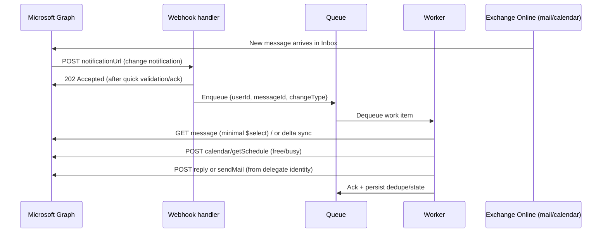

# Deploying an OpenClaw Agent as an Administrative Assistant in Microsoft 365

## Executive summary

An MVP OpenClaw-based administrative assistant in the Microsoft 365 ecosystem is best implemented as an event-driven service that: (a) monitors a user mailbox for “meeting requests” and time‑coordination emails, (b) applies deterministic triage and scheduling rules, and (c) replies through a dedicated delegate mailbox using Exchange Online delegation (“Send As” or “Send on behalf”). The most operationally reliable pattern is Microsoft Graph change notifications (subscriptions) feeding a hardened webhook endpoint, with a queue-backed worker that pulls message details and executes deterministic logic. Webhooks reduce polling, while delta queries provide a durable reconciliation mechanism when notifications are delayed, duplicated, or missed. citeturn21view0turn16view1turn2search6

For authentication/authorization, you should implement the following:

- **Enterprise/IT-friendly (recommended for a “real assistant” service):** **application permissions (app‑only)** via OAuth 2.0 client credentials, **restricted to specific mailboxes** using Exchange Online Application Access Policies; this avoids refresh-token storage, supports mailbox-wide monitoring and subscriptions, and aligns with least-privilege scoping at the mailbox level. 

- A deterministic scheduling MVP should compute availability using **calendar/getSchedule** (free/busy) and rules you control, rather than relying on Graph’s **findMeetingTimes** (which is (1) **delegated-only** and (2) explicitly “fine-tuned from time to time,” meaning outputs may drift even under static inputs). citeturn12view0turn12view2turn10view0

- Security and compliance hinge on blast-radius control (least privilege, mailbox scoping, strong credential handling), auditability (Graph activity logs + Purview audit), and agent hardening against prompt-injection and tool-abuse patterns common in action-taking agents. 

## Functional design and deterministic operating model

The requirements map cleanly onto a two-stage pipeline: **(1) detection and classification** of inbound emails, followed by **(2) deterministic scheduling and reply composition**.

Detection should handle two input categories:

- **Meeting requests** that arrive as Outlook “event message” types. In Graph, a meeting request arrives in an invitee’s mailbox as an **eventMessage** with `meetingMessageType=meetingRequest`; Outlook also automatically creates a tentative calendar event for the invitee. 
- **“Asks for time” emails** that may be ordinary messages asking to schedule (no calendar object yet). These can be detected with deterministic rules (subject/body pattern matching) using message fields such as subject and `bodyPreview`. 

Determinism is easiest if you treat OpenClaw as the “agentic shell” (routing, conversation interface, tool invocation), but keep all “decision authority” in your own rule engine:

- OpenClaw can summarize threads or extract candidate constraints (“next week”, “30 minutes”, “avoid Friday”), but the final triage priority, time-window selection, and proposed time slots should come from deterministic code paths.  
- This reduces risk of “drift” and makes behavior easier to audit and justify (particularly important when acting via delegated mailboxes). 

A practical boundary is:

- **Now:** read mail, classify/triage, compute candidate time slots deterministically, send a reply. citeturn17view0turn12view0turn14view5  
- **Next:** create meetings as a delegate by creating events on the user’s calendar (with idempotency) once the other party confirms a slot. citeturn16view4

## Microsoft Graph APIs and endpoints required

This section focuses on Microsoft Graph REST endpoints that directly implement the MVP functions and the “later” delegated-meeting creation capability.

### Mail ingestion, meeting-request detection, and thread-safe replies

Core mail retrieval:

- `GET /users/{id|userPrincipalName}/mailFolders/{id}/messages` (or `/me/...`) to list messages in a folder; supported with minimal scopes like **Mail.ReadBasic** (or higher). citeturn17view0  
- `GET /users/{id}/mailFolders/{id}/messages/delta` to track incremental changes in a folder and maintain a sync cursor (`@odata.deltaLink`). citeturn16view1turn2search6  
- `GET /users/{id}/messages/{message-id}` to fetch full message properties when a candidate is detected (use sparingly; prefer `$select`). citeturn4search26turn4search19

Meeting-request representation and extraction:

- Meeting requests can appear as **eventMessageRequest** (derived from eventMessage). citeturn18view1turn18view0  
- The **event navigation property** on eventMessage can be used to access the associated calendar event (useful later if you choose to respond programmatically to invites). citeturn18view0turn18view1

Reply mechanisms that preserve conversation/threading:

- `POST /users/{id}/messages/{message-id}/reply` (or `/replyAll`) to reply in a single call (saves to Sent Items). citeturn14view5  
- `POST /users/{id}/messages/{message-id}/createReply` to create a draft reply you can further edit (add structured content, attachments, headers) and then send. citeturn13search0turn14view5

Sending mail (including from delegated identities):

- `POST /users/{id}/sendMail` (or `/me/sendMail`) sends a composed message; includes `saveToSentItems` behavior. citeturn13search2turn0search4  
- To send “from another mailbox” in a delegated-user-token scenario, Graph relies on **Mail.Send.Shared** plus Exchange mailbox permissions, and maps “Send on Behalf” vs “Send As” via `sender` and `from`. citeturn10view2turn8search4

### Deterministic availability lookup and calendar operations

Free/busy lookup (deterministic input → deterministic output on your side):

- `POST /users/{id}/calendar/getSchedule` (or `/me/calendar/getSchedule`) returns availability blocks for users/resources for a time range. It supports both delegated and application permissions and explicitly documents least-privileged options like **Calendars.ReadBasic**. citeturn12view0  
- Use `Prefer: outlook.timezone="..."` to receive start/end times in a desired time zone. citeturn12view0turn5search30

Mailbox time zone / working hours inputs (needed for deterministic rules):

- `GET /users/{id}/mailboxSettings` or `GET /users/{id}/mailboxSettings/timeZone` returns the user’s preferred time zone and supports least-privileged scope **MailboxSettings.Read**. citeturn15view0

Meeting creation (later “delegate creates event” capability):

- `POST /users/{id}/calendar/events` or `POST /users/{id}/calendars/{id}/events` creates an event; application permissions are supported (Calendars.ReadWrite) and examples include an optional `transactionId` for deduplicating retries. citeturn16view4turn3search29

## Identity, OAuth flows, permissions, and token management

### Delegated vs application permissions

Microsoft Graph supports two access scenarios:

- **Delegated access:** app acts on behalf of a signed-in user; effective permissions are the intersection of app scopes and the user’s own rights.   
- **App-only access:** app acts as itself (no user), with “application permissions/app roles,” and can access any data the permission covers (hence the need for strong scoping controls). citeturn21view3turn10view3

For this assistant MVP, the critical practical differences are:

- Webhook subscriptions for Outlook resources often work best with **application permissions** when monitoring mailboxes beyond a signed-in user context; moreover, delegated shared-folder subscriptions have documented limitations. citeturn10view5turn21view0  
- App-only permissions are powerful and typically require **tenant-wide admin consent**; this is explicitly called out as sensitive and should be governed. citeturn21view3turn8search6

### OAuth flows you will use

Delegated path:

- **Authorization code flow (with PKCE as appropriate)** is the standard for obtaining tokens “on behalf of a user,” and supports refresh mechanisms. Microsoft recommends using supported auth libraries rather than hand-crafting protocol calls. citeturn21view4turn7search12  
- Requesting long-lived access typically involves `offline_access` (and secure refresh-token storage), and refresh-token behavior is documented in the identity platform refresh-token guidance. citeturn7search1turn7search4

App-only path (recommended for the MVP service backend):

- **OAuth 2.0 client credentials flow** is explicitly designed for daemon/service-to-service workloads running in the background with no user interaction. citeturn21view5turn10view3  
- In client-credentials scenarios, tokens are obtained per service need and rotated by re-acquiring; `.default` scope patterns are the standard way to request statically-consented application permissions. citeturn1search4turn21view5

### Token caching and refresh strategies

For production reliability, use MSAL token caching (even in app-only flows) to reduce token endpoint traffic and improve resilience:

- MSAL maintains token caches and supports “acquire silently” patterns; for confidential clients, you typically manage cache serialization per user/session if you run delegated flows at scale. citeturn7search3turn7search0  
- If you use delegated tokens, you must design secure persistence for refresh tokens (encrypted at rest, access-controlled) and plan for invalidation (password reset, conditional access changes, consent revocation). citeturn7search1turn8search28

Credential storage best practice:

- Prefer certificate-based client authentication and store certificates as Key Vault certificate objects (not as secrets), with least-privileged access controls and rotation. citeturn7search2turn7search8

Multi-tenant considerations:

- You can register apps as single-tenant or multitenant; multitenant configurations are explicitly documented and determine who can sign in/consent. citeturn14view2turn8search6  
- Microsoft Graph activity logs are tenant-scoped; they help tenant admins see Graph request trails in their own tenant, but do not give you observability into “another tenant” for a multitenant app. This matters if you are building a SaaS assistant. citeturn11search3turn14view1

## Mailbox and calendar delegation design

### Mailbox delegation and “Send As” vs “Send on behalf”

Exchange Online defines three relevant delegate concepts:

- **Full Access**: delegate can open/manage mailbox contents but cannot send as that mailbox. citeturn14view3  
- **Send As**: messages appear to come from the mailbox; if both “Send As” and “Send on behalf” exist, Send As typically takes precedence. citeturn14view3turn10view2  
- **Send on behalf**: recipients see “<delegate> on behalf of <mailbox>.” In Graph message objects, this is modeled via `sender` (actual sender) and `from` (apparent author). citeturn10view2turn18view0

Operational setup:

- Delegation is typically configured in the Exchange admin center or Exchange Online PowerShell. For example, Exchange Online docs describe using `Add-RecipientPermission ... -AccessRights SendAs` and “GrantSendOnBehalfTo” on mailbox/group cmdlets. citeturn14view3

Graph dependency:

- In delegated-token scenarios, Graph requires **Mail.Send.Shared**, and the signed-in user must have the corresponding Exchange mailbox permission(s). Graph explicitly notes it cannot query which mailboxes the user has delegated rights for—so you must maintain your own configuration map (e.g., allowed From addresses per delegate account). citeturn10view2turn8search4

### Dedicated delegate mailbox patterns

Your requirement says replies should come from a dedicated Office 365 delegate account (Send on behalf). In the pattern is:

- **Delegate account sending “on behalf of” the user:** configure “Send on behalf” so the delegate is visible as delegate; Graph maps this using `from` and `sender`.  

### Calendar delegation and “delegate creates events”

Microsoft’s calendar-sharing model distinguishes between “sharing” and “delegation.” Delegates can have write access and can respond to meeting requests on behalf of the owner. citeturn14view4

Graph supports calendar permission objects:

- Creating a calendar permission (share/delegate) is done via the calendar permissions APIs (calendarPermission resource).  
- A key nuance: listing/creating/updating calendar permissions is “supported on behalf of only the calendar owner”; if you try to get permissions “as a delegate,” the collection can be empty. This affects how you build admin tooling. 

Creating the meeting:

- To create an event in the user’s calendar, use the “create event” endpoints with **Calendars.ReadWrite** (delegated or application). This operation supports a client-specified `transactionId` to avoid redundant POSTs during retries/timeouts, which is highly relevant for resilient delegates.

## Eventing, synchronization, and error handling

### Webhooks and subscriptions

Microsoft Graph change notifications allow event-driven handling instead of polling. The subscription model is:

1) create subscription (`POST /subscriptions`),
2) endpoint is validated via a `validationToken`,
3) Graph sends notifications to your `notificationUrl` while subscription is valid. 

Webhook validation requirements are strict:

- Graph calls your endpoint with `validationToken` and expects **HTTP 200**, `text/plain`, and the decoded token returned **within 10 seconds**.  
- Microsoft explicitly advises treating validation tokens as opaque and recommends escaping HTML/JS to reduce XSS-style risks (even though Graph won’t send HTML/JS). 

Subscription lifetimes and renewal:

- Outlook message/event/contact subscriptions have maximum expiration of **10,080 minutes (~7 days)**; subscriptions with resource data (“rich notifications”) have a **1,440 minute (~1 day)** lifetime. 
- Outlook resources also have a **maximum of 1,000 active subscriptions per mailbox for all applications** (design to reuse subscriptions; avoid per-folder explosions). citeturn3search1  
- Lifecycle notifications exist to reduce missed notifications (reauthorizationRequired, removed, missed). Implementing lifecycle handlers is part of building a reliable assistant. 

Practical implications for you:

- You should run a **subscription-renewal job** (e.g., every few hours/day) and store subscription metadata (IDs, expiration, clientState) in durable storage. citeturn10view4turn21view0  
- Your webhook handler should be “thin”: validate/ack quickly, enqueue work, return success; do heavy logic in a worker to avoid timeout risk. citeturn21view0turn6search3

### Delta queries as the “safety net”

Delta query is the canonical way to synchronize changes and recover from notification gaps:

- `message: delta` provides incremental message changes in a folder and returns delta links you persist for later rounds. citeturn16view1turn2search6  
- You should treat webhooks as “wake signals” and delta queries as the authoritative reconciliation mechanism (especially when notifications are duplicated or missed). citeturn11search6turn2search6

### Retry, throttling, and idempotency

Throttling and retries:

- Microsoft Graph uses HTTP **429** with `Retry-After`; the recommended recovery is to wait per `Retry-After` and retry; if missing, use exponential backoff. SDKs often implement these handlers.   
- Design your worker to be queue-driven with visibility timeouts, retry counts, and dead-lettering for poison messages.

Idempotency patterns:

- For **event creation**, use event `transactionId` so that retries don’t create duplicate meetings when the client times out or is retried by queue infrastructure. citeturn16view4turn3search29  
- For **mail replies**, maintain an internal dedupe layer keyed by `(tenantId, mailboxId, messageId/immutableId, actionType)` because `sendMail` and `reply` are not inherently idempotent. Also note Microsoft’s warning not to assume message IDs remain stable after moves/copies; consider immutable IDs where appropriate. citeturn16view3turn18view0

## Security and compliance considerations

### Least privilege and blast-radius control

The assistant touches highly sensitive resources (mail + calendar). Key controls:

- Prefer minimal Graph permissions: the list-messages and delta APIs support “least privileged” permissions such as **Mail.ReadBasic** or **Mail.ReadBasic.All** for app-only (with higher scopes only if you must read bodies/attachments). citeturn17view0turn16view1  
- For free/busy, `getSchedule` supports **Calendars.ReadBasic** as least privileged, reducing exposure compared to full event read. citeturn12view0  
- App-only permissions for Exchange data sets (mail/calendars/contacts/mailbox settings) can reach all mailboxes by default; the documented mitigation is Exchange Online **Application Access Policies** restricting access to mail-enabled security groups of allowed mailboxes. citeturn10view3turn1search2

### Consent, admin consent, and governance

- Application permissions require admin consent; Microsoft explicitly warns that granting tenant-wide admin consent is sensitive because it can expose large portions of organizational data unless restricted. citeturn8search6turn21view3  
- Maintain a formal permission review, and pin permissions to MVP scope only.

### Audit logging and monitoring

For forensic readiness and operational confidence:

- Microsoft Graph activity logs provide an audit trail of HTTP requests Graph receives/processes for a tenant and can be streamed via Azure Monitor diagnostic settings to Log Analytics/Storage/Event Hubs. citeturn14view1turn11search7  
- Microsoft Purview auditing solutions provide a unified audit log capturing many user/admin operations across Microsoft services, supporting investigations and compliance obligations. citeturn4search10turn4search3

### Data residency and retention boundaries

- Exchange Online mailbox geography and data residency are tenant properties (and can be discovered/administered); mailbox location and regional properties are documented in Exchange Online data residency guidance. citeturn5search3turn5search11  
- Align your agent’s data stores with your tenant’s compliance posture: store only necessary metadata (message ID, sender, derived classification, chosen time slots) rather than full message bodies, unless required.

### Agent-specific hardening for OpenClaw

OpenClaw positions itself as an assistant that can “clear your inbox” and “manage your calendar,” so it’s inherently an action-taking agent with significant blast radius if misconfigured. citeturn19search9

Two high-priority controls for OpenClaw-style agent frameworks:

- **Input-to-tool execution control:** treat email bodies and external content as untrusted inputs that can influence tool execution; Microsoft’s security guidance for OpenClaw emphasizes inventorying deployments, verifying identities/permissions used, and identifying which inputs can influence tool execution to reduce blast radius. citeturn20view0  
- **Skill/plugin supply chain controls:** OpenClaw’s own security program highlights that skills run as code “in your agent’s context” with access to tools/data, and it has added malware-scanning layers (VirusTotal) for skill marketplace content—useful, but not a complete guarantee. For enterprise deployments, pin to a vetted allowlist of internal skills and disable arbitrary third-party skill execution. citeturn20view1

## Deployment options, reference architecture, and MVP plan

### Recommended architecture

The architecture below is designed to be deterministic, auditable, and resilient (queue-backed), while still compatible with OpenClaw as the orchestration layer.

```mermaid
flowchart LR
  subgraph M365[Microsoft 365]
    UMailbox[User mailbox: Inbox + Calendar]
    DMailbox[Delegate mailbox: Send-As / Send-on-behalf]
    Graph[Microsoft Graph]
  end

  subgraph Azure[Azure-hosted MVP]
    Webhook[Webhook handler\n(validateToken + enqueue)]
    Queue[Queue\n(Service Bus / Storage Queue)]
    Worker[Deterministic worker\n(classify + schedule + reply)]
    Store[State store\n(subscriptions, deltaLinks, dedupe)]
    Vault[Key Vault\n(cert/secret)]
  end

  Graph -->|Change notifications| Webhook
  Webhook --> Queue
  Queue --> Worker
  Worker --> Store
  Worker -->|GET messages/delta| Graph
  Worker -->|getSchedule| Graph
  Worker -->|sendMail/reply| Graph
  Vault --> Worker
  UMailbox --> Graph
  DMailbox --> Graph
```

This aligns with Graph’s webhook validation constraints (fast response) and supports durable processing with retries/backoff. citeturn21view0turn21view2turn10view4

### Deterministic triage rule examples and pseudocode

A deterministic triage model should avoid probabilistic scoring from the LLM. Typical rule inputs you can obtain deterministically from Graph message metadata include: internal vs external sender domain, known VIP allowlist, mail importance flag, presence of deadlines, and meeting-request type. citeturn18view0turn17view0

Example triage rules (illustrative):

- **Priority 0 (immediate):** sender is in `VIP_EMAILS`, OR the email indicates urgency AND the sender is in `DIRECT_REPORTS`. Schedule within 48 hours unless the sender specifies a different time horizon. If no slot is available, a Priority 0 meeting may bump a lower-priority meeting only when that meeting has fewer than 6 attendees and none of those attendees are in `VIP_EMAILS`.
- **Priority 1:** requests that the mailbox owner initiates — when the owner asks to set up a meeting with specific people, schedule it within the agreed time horizon; OR requests from a sender who is not in `VIP_EMAILS` but is from the `emblem.email` domain; OR requests from any sender in `PRIORITY_1`.
- **Priority 2:** requests from senders in `DIRECT_REPORTS` or `PRIORITY_2`. Recurring meetings receive a sub-classification:
  - A recurring meeting whose only other attendee is the owner is a **1:1**. A 1:1 may be moved at most twice per six occurrences and never two weeks in a row.
  - A recurring meeting with more than 5 attendees is a **recurring forum**. A recurring forum cannot be moved except by explicit request from the owner or the meeting owner. When a Priority 0 request conflicts with a forum, the assistant may note that the owner could skip the forum, but it cannot cancel the meeting; the owner skips only when explicitly directed by a Priority 0 constituent or by the owner.
- **Priority 3:** requests from internal requestors or external senders in `PRIORITY_3`. Schedule within 8–21 days when the request meets the criteria to schedule a meeting.
- **Priority 4:** requests from unknown external senders. If the sender is an unknown recruiter, escalate to the owner. Otherwise add the request to a digest of ignored requests (these are likely spam).

Pseudocode:

```pseudo
function triage(message, context):
  sender  = normalize(message.from.emailAddress.address)
  domain  = sender_domain(sender)
  subject = normalize(message.subject)
  preview = normalize(message.bodyPreview)

  isUrgent = (message.importance == "high") or
             regex_match(subject + " " + preview, r"\burgent\b")

  // Priority 1: requests the owner initiated (schedule within the agreed horizon)
  if context.initiatedByOwner:
    return P1

  // Priority 0: VIPs, or urgent requests from direct reports
  if sender in VIP_EMAILS:
    return P0
  if isUrgent and sender in DIRECT_REPORTS:
    return P0

  // Priority 1: non-VIP emblem.email senders, or the explicit P1 list
  if sender not in VIP_EMAILS and domain == "emblem.email":
    return P1
  if sender in PRIORITY_1:
    return P1

  // Priority 2: direct reports or the explicit P2 list
  if sender in DIRECT_REPORTS or sender in PRIORITY_2:
    return P2

  // Priority 3: internal requestors or the explicit P3 list (schedule in 8-21 days)
  if domain == INTERNAL_DOMAIN or sender in PRIORITY_3:
    return P3

  // Priority 4: unknown external senders
  if is_unknown_recruiter(message):
    return ESCALATE_TO_OWNER
  return DIGEST_IGNORED   // likely spam
```

Recurring meetings carry an additional move policy, evaluated when a higher-priority
request tries to claim an occupied slot:

```pseudo
function classify_recurring(meeting, owner):
  if not meeting.isRecurring:
    return NON_RECURRING
  others = meeting.attendees excluding the organizer
  if others == [owner]:                 // organizer + owner only
    return ONE_ON_ONE
  if meeting.attendees.count > 5:
    return RECURRING_FORUM
  return RECURRING_OTHER

function can_move(meeting, owner, requester, requestPriority):
  kind = classify_recurring(meeting, owner)

  if kind == ONE_ON_ONE:
    // at most twice per rolling six occurrences, never two weeks in a row
    return moves_in_last_six_occurrences(meeting) < 2
           and not moved_previous_week(meeting)

  if kind == RECURRING_FORUM:
    // immovable except by explicit owner / meeting-owner request;
    // a P0 conflict may surface a "skip" suggestion but cannot cancel
    return requester == owner or requester == meeting.owner

  // a P0 request may bump only small, non-VIP meetings
  if requestPriority == P0:
    return meeting.attendees.count < 6
           and none(meeting.attendees in VIP_EMAILS)

  return true
```

Meeting-time selection should be deterministic and driven by `getSchedule` plus a policy table: working hours, minimum notice, preferred meeting lengths, “no-meeting blocks,” and time-zone normalization using mailbox settings. citeturn12view0turn15view0

Deterministic availability algorithm sketch:

```pseudo
function propose_times(request, userMailboxId):
  tz = graph.get("/users/{userMailboxId}/mailboxSettings/timeZone")
  workingHours = graph.get("/users/{userMailboxId}/mailboxSettings/workingHours")

  window = compute_window(request, workingHours, tz)  // e.g., next 5 business days, 9-17
  freeBusy = graph.post("/users/{userMailboxId}/calendar/getSchedule", window)

  candidateSlots = []
  for day in window.days:
    for slot in day.slots(step=30min):
      if slot inside workingHours AND slot not in NO_MEETING_BLOCKS
         AND freeBusy(slot) == "free"
         AND slot starts >= now + MIN_NOTICE:
          candidateSlots.append(slot)

  // deterministic ranking: earliest-first, then preference (e.g., Tue-Thu > Mon/Fri)
  candidateSlots = sort(candidateSlots, by=[dayPreference, startTime])

  return first N slots (e.g., 3-5), formatted in tz
```

### End-to-end flow example



This combines push (notifications) with pull (delta/message fetch) for correctness. citeturn21view0turn16view1turn14view5

### Implementation options comparison

| Option | Strengths | Constraints / risks | Best fit for MVP |
|---|---|---|---|
| Azure Functions (HTTP webhook + queue-trigger worker) | Designed for event-driven scaling; easy to separate webhook and worker; strong ecosystem for queues/monitoring citeturn6search1turn6search3 | Cold-start and runtime constraints must be managed; more “code” to build than low-code options citeturn6search3 | **Recommended** (flexible, deterministic logic, easy webhook compliance) |
| Azure Container Apps (webhook API + background worker) | Fully managed “serverless containers,” automatic scaling, good for long-running workers and custom runtimes citeturn6search31turn6search16 | Slightly more ops surface than Functions; need container build/pipeline | Strong if OpenClaw runtime is containerized already |
| Azure Logic Apps | Low-code orchestration with Azure-native integration, DevOps + monitoring advantages over Power Automate citeturn6search9turn6search25 | Complex deterministic logic/policies can get unwieldy; webhook validation and high-control auth flows may require custom code anyway citeturn21view0turn6search25 | Good as orchestrator, but often paired with a code webhook |
| Power Automate | Fastest citizen-dev path inside Microsoft 365; many connectors | Less control over auth nuances, deterministic policy engines, and webhook validation behaviors; licensing and scale constraints | Best for prototypes, not for a hardened “assistant agent” backend citeturn6search9turn6search25 |

### Prioritized step-by-step MVP plan with effort and risks

The effort estimates below assume one experienced engineer with admin access to the tenant, plus occasional IT/security review.

Build foundation (2–4 days)

- Register an app in Entra ID; choose **single-tenant** for MVP unless you are explicitly building SaaS. citeturn8search8turn14view2  
- Decide permission model: **app-only + Application Access Policy** (recommended) vs delegated. Configure API permissions accordingly and obtain admin consent. citeturn21view3turn10view3turn8search6  
- Create a dedicated delegate mailbox (licensed or shared mailbox, per org policy) and configure Send As / Send on behalf delegation using Exchange admin center or PowerShell. citeturn14view3turn10view2

Risks: admin consent approvals can take time; delegation settings can be misunderstood (Send As vs on behalf precedence). citeturn14view3

Implement ingestion + eventing (3–6 days)

- Build webhook endpoint that passes Graph validation token requirements and quickly enqueues work. citeturn21view0turn11search1  
- Create message subscriptions to the relevant inbox folder(s) and implement renewal logic respecting subscription lifetimes. citeturn10view4turn21view0  
- Add delta-query reconciliation for the inbox folder (`messages/delta`) and persist `@odata.deltaLink`. citeturn16view1turn2search6

Risks: subscription renewal bugs cause silent degradation; webhook endpoint must be internet-reachable and fast.

Deterministic detection + triage (2–4 days)

- Implement meeting-request detection via eventMessage semantics (`meetingMessageType`) and “ask for time” regex rules. citeturn18view0turn17view0  
- Implement deterministic priority rules and routing/queuing.  
- Add a configuration store for VIP lists, internal domains, allowed external senders.

Risks: false positives/negatives in pattern matching; need controlled rollout.

Deterministic scheduling + reply (4–7 days)

- Implement `getSchedule` calls and deterministic slot selection respecting mailbox time zone/working hours. citeturn12view0turn15view0  
- Send replies using `/reply` or `/createReply` then send; ensure send uses the delegate mailbox identity and (if required) Send As / on-behalf semantics. citeturn10view2turn14view5turn13search2  
- Implement throttling-safe retries (429 + Retry-After). citeturn21view2

Risks: time-zone edge cases; schedule “truth” vs user expectations; throttling under bursts.

Operational hardening (2–5 days)

- Turn on Graph activity logs to Log Analytics and set alerts for anomalous call volume or privileged operations. citeturn14view1  
- Add Purview audit review procedures for mailbox delegation changes and agent actions. citeturn4search10turn4search3  
- Apply defensive controls for OpenClaw runtime: strict skill allowlist, tool execution constraints, and monitored identity/permissions. citeturn20view0turn20view1

Risks: without strong controls, action-taking agents create governance risk; skill supply-chain risks require defense-in-depth.

Enable “create events as delegate” later (3–6 days)

- Add a confirmation step (explicit “yes” from user or deterministic confirmation email from requester).  
- Create events using `POST /users/{id}/calendar/events` with `transactionId` and send invitations. citeturn16view4turn3search29  
- Optionally, manage calendar delegation via calendarPermission APIs (noting owner-only management semantics). citeturn1search3turn1search10

Risks: mistaken bookings; duplicate meetings without `transactionId`; additional compliance review may be required for automatic invites.

